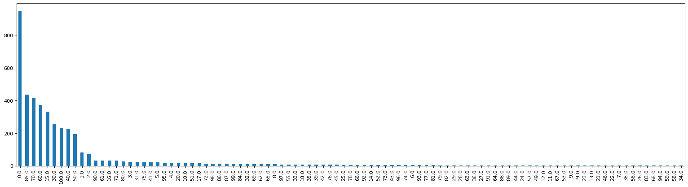
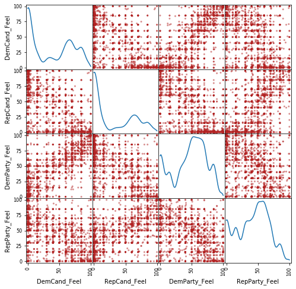

# Downloads and Imports


```python
import os
import numpy as np
import pandas as pd
import matplotlib.pyplot as plt
import seaborn as sns
```

# Raising funds


```python
print(os.getcwd())
```

    /content


```python
df = pd.read_csv('/content/drive/MyDrive/Data/weball20.txt', sep='|', header=None)
print(df)
```

                 0                          1  2   3    4           5          6   \
    0     H8AK00132             SHEIN, DIMITRI  C   1  DEM        0.00       0.00   
    1     H6AK00045            YOUNG, DONALD E  I   2  REP  1950289.86  138304.94   
    2     H8AK01031        NELSON, THOMAS JOHN  C   2  REP        0.00       0.00   
    3     H8AK00140              GALVIN, ALYSE  C   3  IND  5253251.54   60024.76   
    4     H0AL01097            AVERHART, JAMES  O   1  DEM    80094.95       0.00   
    ...         ...                        ... ..  ..  ...         ...        ...   
    3984  S0WY00186  HOLTHUS, ROLLAND SCOTT MR  O   2  REP     4291.94       0.00   
    3985  S4WY00097           HARDY, CHARLES E  C   2  REP        0.00       0.00   
    3986  S4WY00147              MILLER, BRYAN  O   2  REP    50876.53    3685.02   
    3987  S6WY00068           BARRASSO, JOHN A  I   2  REP  1008180.71   28538.06   
    3988  S6WY00126            ENZI, MICHAEL B  I   2  REP   141784.99       0.00   
    
                  7        8           9   ...  20  21  22  23  24         25  \
    0         367.52     0.00      367.52  ... NaN NaN NaN NaN NaN       0.00   
    1     1817836.79     0.00   116720.12  ... NaN NaN NaN NaN NaN  839094.63   
    2         466.51     0.00      466.51  ... NaN NaN NaN NaN NaN       0.00   
    3     5162902.93     0.00     6245.09  ... NaN NaN NaN NaN NaN  340486.99   
    4       78973.24     0.00        0.00  ... NaN NaN NaN NaN NaN       0.00   
    ...          ...      ...         ...  ...  ..  ..  ..  ..  ..        ...   
    3984     4291.94     0.00        0.00  ... NaN NaN NaN NaN NaN       0.00   
    3985      165.00     0.00      165.00  ... NaN NaN NaN NaN NaN       0.00   
    3986    50876.53  3685.02        0.00  ... NaN NaN NaN NaN NaN       0.00   
    3987   844064.26     0.00  3957773.06  ... NaN NaN NaN NaN NaN  416150.00   
    3988   369883.72     0.00   481110.30  ... NaN NaN NaN NaN NaN  117600.00   
    
               26          27        28       29  
    0         0.0  09/30/2019      0.00      0.0  
    1       500.0  12/31/2020  19609.67   5500.0  
    2         0.0  03/31/2019      0.00      0.0  
    3     10025.0  12/31/2020  32594.02      0.0  
    4         0.0  12/31/2020      0.00      0.0  
    ...       ...         ...       ...      ...  
    3984      0.0  07/07/2020      0.00      0.0  
    3985      0.0  03/28/2019      0.00      0.0  
    3986      0.0  12/31/2020      0.00      0.0  
    3987      0.0  12/31/2020      0.00   9300.0  
    3988      0.0  12/31/2020  12650.00  68500.0  
    
    [3989 rows x 30 columns]


```python
df1 = df.drop(columns=[3,6,7,8,9,10,11,12,13,14,15,16,17,19,20,21,22,24,25,26,27,28,29])
```

State and district are in column 19 and 20 respectively. Contributions are in column 26, 27 respectively.
The whole dataset correspond to a year.


```python
df1 = df1.rename(columns = {0:"ID"})
df1 = df1.rename(columns = {1:"Name"}) 
df1 = df1.rename(columns = {2:"I/C"})
df1 = df1.rename(columns = {4:"Party"}) 
df1 = df1.rename(columns = {5:"$$"})
df1 = df1.rename(columns = {18:"State"}) 
df1 = df1.rename(columns = {23:"Status"})
```


```python
top25 = df1[df1["$$"] > 2]
print(top25.sort_values("$$", ascending=False).head(25))
```

                 ID                            Name I/C Party            $$ State  \
    3303  P20003851       ELGAR, MISS BETSY PAULINE   C   CON  4.824618e+09    00   
    3232  P00014530           BLOOMBERG, MICHAEL R.   C   DEM  1.124593e+09    00   
    3250  P80000722              BIDEN, JOSEPH R JR   C   DEM  1.074180e+09    00   
    3295  P80001571                TRUMP, DONALD J.   I   REP  7.443502e+08    00   
    3251  P80003205                MERCER, LEE L JR   C   DEM  6.400000e+08    00   
    3228  P00012716                     STEYER, TOM   C   DEM  3.530420e+08    00   
    3246  P60007168                SANDERS, BERNARD   C   DEM  2.189070e+08    00   
    3521  S8GA00180             OSSOFF, T. JONATHAN   C   DEM  1.561465e+08    GA   
    3860  S0SC00289                 HARRISON, JAIME   C   DEM  1.326857e+08    SC   
    3204  P00009621               WARREN, ELIZABETH   C   DEM  1.313681e+08    00   
    3516  S0GA00559                WARNOCK, RAPHAEL   C   DEM  1.253591e+08    GA   
    3862  S0SC00149              GRAHAM, LINDSEY O.   I   REP  1.077475e+08    SC   
    3426  S0AZ00350                     KELLY, MARK   I   DEM  1.011066e+08    AZ   
    3533  S4GA11285                   PERDUE, DAVID   I   REP  9.920297e+07    GA   
    3607  S0KY00339                    MCGRATH, AMY   C   DEM  9.633168e+07    KY   
    3523  S0GA00526                 LOEFFLER, KELLY   I   REP  9.221328e+07    GA   
    3660  S0ME00111                    GIDEON, SARA   C   DEM  7.562914e+07    ME   
    3436  S8AZ00221                 MCSALLY, MARTHA   I   REP  7.355330e+07    AZ   
    3618  S2KY00012                MCCONNELL, MITCH   I   REP  6.809490e+07    KY   
    3545  S0IA00176             GREENFIELD, THERESA   C   DEM  5.635830e+07    IA   
    3254  P80006117               KLOBUCHAR, AMY J.   C   DEM  5.456927e+07    00   
    3721  S0NC00202                 CUNNINGHAM, CAL   C   DEM  5.256913e+07    NC   
    3674  S4MI00355                    PETERS, GARY   I   DEM  5.011327e+07    MI   
    1477  H8MI09068                    PETERS, GARY   C   DEM  5.011327e+07    MI   
    3352  P00009696  BEHRMAN, DAN TAXATION IS THEFT   C   LIB  5.004389e+07    00   
    
          Status  
    3303     NaN  
    3232     NaN  
    3250     NaN  
    3295     NaN  
    3251     NaN  
    3228     NaN  
    3246     NaN  
    3521     NaN  
    3860     NaN  
    3204     NaN  
    3516     NaN  
    3862     NaN  
    3426     NaN  
    3533     NaN  
    3607     NaN  
    3523     NaN  
    3660     NaN  
    3436     NaN  
    3618     NaN  
    3545     NaN  
    3254     NaN  
    3721     NaN  
    3674     NaN  
    1477     NaN  
    3352     NaN  


# Districting


```python
! pip install geopandas folium -U matplotlib mapclassify contextily
! pip install folium -U
! pip install -I matplotlib==3.1.1
import matplotlib.pyplot as plt
import geopandas
import contextily as cx
from shapely.geometry import Point
```

    Requirement already satisfied: geopandas in /usr/local/lib/python3.7/dist-packages (0.10.2)
    Requirement already satisfied: folium in /usr/local/lib/python3.7/dist-packages (0.12.1.post1)
    Requirement already satisfied: matplotlib in /usr/local/lib/python3.7/dist-packages (3.5.2)
    Requirement already satisfied: mapclassify in /usr/local/lib/python3.7/dist-packages (2.4.3)
    Requirement already satisfied: contextily in /usr/local/lib/python3.7/dist-packages (1.2.0)
    Requirement already satisfied: pyproj>=2.2.0 in /usr/local/lib/python3.7/dist-packages (from geopandas) (3.2.1)
    Requirement already satisfied: fiona>=1.8 in /usr/local/lib/python3.7/dist-packages (from geopandas) (1.8.21)
    Requirement already satisfied: pandas>=0.25.0 in /usr/local/lib/python3.7/dist-packages (from geopandas) (1.3.5)
    Requirement already satisfied: shapely>=1.6 in /usr/local/lib/python3.7/dist-packages (from geopandas) (1.8.1.post1)
    Requirement already satisfied: setuptools in /usr/local/lib/python3.7/dist-packages (from fiona>=1.8->geopandas) (57.4.0)
    Requirement already satisfied: cligj>=0.5 in /usr/local/lib/python3.7/dist-packages (from fiona>=1.8->geopandas) (0.7.2)
    Requirement already satisfied: munch in /usr/local/lib/python3.7/dist-packages (from fiona>=1.8->geopandas) (2.5.0)
    Requirement already satisfied: click>=4.0 in /usr/local/lib/python3.7/dist-packages (from fiona>=1.8->geopandas) (7.1.2)
    Requirement already satisfied: certifi in /usr/local/lib/python3.7/dist-packages (from fiona>=1.8->geopandas) (2021.10.8)
    Requirement already satisfied: six>=1.7 in /usr/local/lib/python3.7/dist-packages (from fiona>=1.8->geopandas) (1.16.0)
    Requirement already satisfied: attrs>=17 in /usr/local/lib/python3.7/dist-packages (from fiona>=1.8->geopandas) (21.4.0)
    Requirement already satisfied: click-plugins>=1.0 in /usr/local/lib/python3.7/dist-packages (from fiona>=1.8->geopandas) (1.1.1)
    Requirement already satisfied: pytz>=2017.3 in /usr/local/lib/python3.7/dist-packages (from pandas>=0.25.0->geopandas) (2022.1)
    Requirement already satisfied: python-dateutil>=2.7.3 in /usr/local/lib/python3.7/dist-packages (from pandas>=0.25.0->geopandas) (2.8.2)
    Requirement already satisfied: numpy>=1.17.3 in /usr/local/lib/python3.7/dist-packages (from pandas>=0.25.0->geopandas) (1.21.6)
    Requirement already satisfied: jinja2>=2.9 in /usr/local/lib/python3.7/dist-packages (from folium) (2.11.3)
    Requirement already satisfied: branca>=0.3.0 in /usr/local/lib/python3.7/dist-packages (from folium) (0.5.0)
    Requirement already satisfied: requests in /usr/local/lib/python3.7/dist-packages (from folium) (2.23.0)
    Requirement already satisfied: MarkupSafe>=0.23 in /usr/local/lib/python3.7/dist-packages (from jinja2>=2.9->folium) (2.0.1)
    Requirement already satisfied: pyparsing>=2.2.1 in /usr/local/lib/python3.7/dist-packages (from matplotlib) (3.0.8)
    Requirement already satisfied: fonttools>=4.22.0 in /usr/local/lib/python3.7/dist-packages (from matplotlib) (4.33.3)
    Requirement already satisfied: packaging>=20.0 in /usr/local/lib/python3.7/dist-packages (from matplotlib) (21.3)
    Requirement already satisfied: cycler>=0.10 in /usr/local/lib/python3.7/dist-packages (from matplotlib) (0.11.0)
    Requirement already satisfied: pillow>=6.2.0 in /usr/local/lib/python3.7/dist-packages (from matplotlib) (7.1.2)
    Requirement already satisfied: kiwisolver>=1.0.1 in /usr/local/lib/python3.7/dist-packages (from matplotlib) (1.4.2)
    Requirement already satisfied: typing-extensions in /usr/local/lib/python3.7/dist-packages (from kiwisolver>=1.0.1->matplotlib) (4.2.0)
    Requirement already satisfied: scipy>=1.0 in /usr/local/lib/python3.7/dist-packages (from mapclassify) (1.4.1)
    Requirement already satisfied: scikit-learn in /usr/local/lib/python3.7/dist-packages (from mapclassify) (1.0.2)
    Requirement already satisfied: networkx in /usr/local/lib/python3.7/dist-packages (from mapclassify) (2.6.3)
    Requirement already satisfied: xyzservices in /usr/local/lib/python3.7/dist-packages (from contextily) (2022.4.0)
    Requirement already satisfied: mercantile in /usr/local/lib/python3.7/dist-packages (from contextily) (1.2.1)
    Requirement already satisfied: geopy in /usr/local/lib/python3.7/dist-packages (from contextily) (1.17.0)
    Requirement already satisfied: rasterio in /usr/local/lib/python3.7/dist-packages (from contextily) (1.2.10)
    Requirement already satisfied: joblib in /usr/local/lib/python3.7/dist-packages (from contextily) (1.1.0)
    Requirement already satisfied: geographiclib<2,>=1.49 in /usr/local/lib/python3.7/dist-packages (from geopy->contextily) (1.52)
    Requirement already satisfied: snuggs>=1.4.1 in /usr/local/lib/python3.7/dist-packages (from rasterio->contextily) (1.4.7)
    Requirement already satisfied: affine in /usr/local/lib/python3.7/dist-packages (from rasterio->contextily) (2.3.1)
    Requirement already satisfied: chardet<4,>=3.0.2 in /usr/local/lib/python3.7/dist-packages (from requests->folium) (3.0.4)
    Requirement already satisfied: urllib3!=1.25.0,!=1.25.1,<1.26,>=1.21.1 in /usr/local/lib/python3.7/dist-packages (from requests->folium) (1.24.3)
    Requirement already satisfied: idna<3,>=2.5 in /usr/local/lib/python3.7/dist-packages (from requests->folium) (2.10)
    Requirement already satisfied: threadpoolctl>=2.0.0 in /usr/local/lib/python3.7/dist-packages (from scikit-learn->mapclassify) (3.1.0)
    Requirement already satisfied: folium in /usr/local/lib/python3.7/dist-packages (0.12.1.post1)
    Requirement already satisfied: branca>=0.3.0 in /usr/local/lib/python3.7/dist-packages (from folium) (0.5.0)
    Requirement already satisfied: numpy in /usr/local/lib/python3.7/dist-packages (from folium) (1.21.6)
    Requirement already satisfied: jinja2>=2.9 in /usr/local/lib/python3.7/dist-packages (from folium) (2.11.3)
    Requirement already satisfied: requests in /usr/local/lib/python3.7/dist-packages (from folium) (2.23.0)
    Requirement already satisfied: MarkupSafe>=0.23 in /usr/local/lib/python3.7/dist-packages (from jinja2>=2.9->folium) (2.0.1)
    Requirement already satisfied: idna<3,>=2.5 in /usr/local/lib/python3.7/dist-packages (from requests->folium) (2.10)
    Requirement already satisfied: urllib3!=1.25.0,!=1.25.1,<1.26,>=1.21.1 in /usr/local/lib/python3.7/dist-packages (from requests->folium) (1.24.3)
    Requirement already satisfied: certifi>=2017.4.17 in /usr/local/lib/python3.7/dist-packages (from requests->folium) (2021.10.8)
    Requirement already satisfied: chardet<4,>=3.0.2 in /usr/local/lib/python3.7/dist-packages (from requests->folium) (3.0.4)
    Collecting matplotlib==3.1.1
      Using cached matplotlib-3.1.1-cp37-cp37m-manylinux1_x86_64.whl (13.1 MB)
    Collecting numpy>=1.11
      Using cached numpy-1.21.6-cp37-cp37m-manylinux_2_12_x86_64.manylinux2010_x86_64.whl (15.7 MB)
    Collecting kiwisolver>=1.0.1
      Using cached kiwisolver-1.4.2-cp37-cp37m-manylinux_2_5_x86_64.manylinux1_x86_64.whl (1.1 MB)
    Collecting python-dateutil>=2.1
      Using cached python_dateutil-2.8.2-py2.py3-none-any.whl (247 kB)
    Collecting pyparsing!=2.0.4,!=2.1.2,!=2.1.6,>=2.0.1
      Using cached pyparsing-3.0.8-py3-none-any.whl (98 kB)
    Collecting cycler>=0.10
      Using cached cycler-0.11.0-py3-none-any.whl (6.4 kB)
    Collecting typing-extensions
      Using cached typing_extensions-4.2.0-py3-none-any.whl (24 kB)
    Collecting six>=1.5
      Using cached six-1.16.0-py2.py3-none-any.whl (11 kB)
    Installing collected packages: typing-extensions, six, python-dateutil, pyparsing, numpy, kiwisolver, cycler, matplotlib
    ERROR: pip's dependency resolver does not currently take into account all the packages that are installed. This behaviour is the source of the following dependency conflicts.
    tensorflow 2.8.0 requires tf-estimator-nightly==2.8.0.dev2021122109, which is not installed.
    google-colab 1.0.0 requires six~=1.15.0, but you have six 1.16.0 which is incompatible.
    datascience 0.10.6 requires folium==0.2.1, but you have folium 0.12.1.post1 which is incompatible.
    albumentations 0.1.12 requires imgaug<0.2.7,>=0.2.5, but you have imgaug 0.2.9 which is incompatible.
    Successfully installed cycler-0.11.0 kiwisolver-1.4.2 matplotlib-3.5.2 numpy-1.21.6 pyparsing-3.0.8 python-dateutil-2.8.2 six-1.16.0 typing-extensions-4.2.0


We inspect the districting plan proposed by both the Democratic and Republican. Note that Shapefiles are a collection of files, instead of just one single file.


```python
from zipfile import ZipFile

with ZipFile('/content/drive/MyDrive/Data/ny_2020_congress_letters_draft_2021-09-15.zip', 'r') as zipObj:
   # Extract all the contents of zip file in different directory
   zipObj.extractall('nydem2020')
ny_dem = geopandas.read_file('nydem2020')

with ZipFile('/content/drive/MyDrive/Data/ny_2020_congress_names_draft_2021-09-15.zip', 'r') as zipObj:
   # Extract all the contents of zip file in different directory
   zipObj.extractall('nyrepub2020')
ny_repub = geopandas.read_file('nyrepub2020')
```


```python
print(len(ny_dem.columns)) 
for col_name in ny_dem.columns:
  print(col_name, end=' ')
```

    23
    ID AREA DISTRICT MEMBERS LOCKED NAME POPULATION CVAP_1519_ CVAP_15191 CVAP_15192 CVAP_15193 CVAP_15194 IDEAL_VALU DEVIATION F_DEVIATIO F_CVAP_151 F_CVAP_152 F_CVAP_153 F_CVAP_154 F_CVAP_155 MULTIPLE_F DISTRICT_L geometry 

Explore the different styles available in Pyplot.


```python
fig = plt.figure(dpi=100, figsize=(10, 20), tight_layout=True)
available = ['default'] + plt.style.available
for i, style in enumerate(available):
    with plt.style.context(style):
        ax = fig.add_subplot(10, 3, i + 1)
        ny_dem.plot(ax=ax)
    ax.set_title(style)
```


The last column is the geometry column. We use iat to extract one of its entry (a district) and then inspect it.


```python
geom_cd1 = ny_dem.iat[0,22]
print('type of geom_cd1 is', geom_cd1.geom_type) 
print('Area of CD1 is', geom_cd1.area) 
print('Length of CD1 is', geom_cd1.length) 
print(geom_cd1)
```

    type of geom_cd1 is Polygon
    Area of CD1 is 0.49612352814600036
    Length of CD1 is 4.547818041054305
    POLYGON ((-72.98406 40.966118, -72.981785 40.966274, -72.979979 40.966373, -72.974131 40.966609, -72.969243 40.966884, -72.967459 40.966758, -72.957258 40.966053, -72.95487 40.966278, -72.95075 40.966018, -72.937822 40.964441, -72.937748 40.964432, -72.933612 40.963934, -72.932042 40.963508, -72.925725 40.962786, -72.924922 40.962883, -72.918426 40.962658, -72.915899 40.962642, -72.913837 40.962467, -72.910573 40.962532, -72.907004 40.962693, -72.904921 40.962787, -72.902906 40.962657, -72.901231 40.962713, -72.899 40.962787, -72.896122 40.962547, -72.893369 40.962692, -72.886876 40.963108, -72.88377 40.963489, -72.881818 40.963589, -72.880055 40.963568, -72.879056 40.963667, -72.871358 40.964434, -72.868282 40.965316, -72.867031 40.965491, -72.866516 40.964173, -72.865994 40.962832, -72.865048 40.962948, -72.86572 40.964289, -72.865788 40.965458, -72.864446 40.965522, -72.864407 40.965377, -72.864282 40.965122, -72.863607 40.964105, -72.863465 40.964328, -72.863804 40.965426, -72.863614 40.973824, -72.863596 40.974658, -72.863683 40.974652, -72.863681 41.000103, -72.863689 41.038348, -72.863707 41.113379, -72.863507 41.113417, -72.862907 41.113533, -72.862708 41.113572, -72.862182 41.113673, -72.860606 41.113978, -72.860081 41.11408, -72.857917 41.114498, -72.851428 41.115753, -72.849265 41.116172, -72.848606 41.116299, -72.846633 41.11668, -72.845975 41.116808, -72.842345 41.117509, -72.831457 41.119616, -72.827828 41.120318, -72.822885 41.121273, -72.815724 41.122658, -72.808057 41.12414, -72.80362 41.124999, -72.803368 41.125048, -72.803115 41.125097, -72.801496 41.125404, -72.796642 41.126326, -72.795024 41.126634, -72.785897 41.128367, -72.758519 41.13357, -72.749393 41.135305, -72.746677 41.135825, -72.738532 41.137389, -72.735817 41.137911, -72.727596 41.139488, -72.702937 41.144222, -72.694717 41.1458, -72.693972 41.145942, -72.69174 41.14637, -72.690996 41.146513, -72.682292 41.14818, -72.656181 41.153185, -72.647478 41.154854, -72.623562 41.159437, -72.611352 41.161778, -72.575225 41.168703, -72.551816 41.173189, -72.551563 41.173238, -72.527901 41.177774, -72.517604 41.179724, -72.486715 41.185578, -72.476419 41.18753, -72.475027 41.187793, -72.470854 41.188584, -72.469464 41.188848, -72.459908 41.190658, -72.431243 41.196092, -72.421688 41.197903, -72.420989 41.198035, -72.418892 41.198432, -72.418194 41.198565, -72.415023 41.199165, -72.405514 41.200968, -72.402344 41.201569, -72.40118 41.201789, -72.397692 41.20245, -72.396529 41.202671, -72.383519 41.205136, -72.344489 41.212533, -72.33148 41.214999, -72.331453 41.215004, -72.315072 41.218108, -72.265933 41.227421, -72.249553 41.230526, -72.249348 41.230563, -72.248733 41.230673, -72.248529 41.230711, -72.242901 41.23173, -72.22602 41.234788, -72.220393 41.235808, -72.213596 41.23704, -72.21229 41.237277, -72.204188 41.238744, -72.1953 41.240355, -72.193207 41.240734, -72.186411 41.241965, -72.186321 41.241981, -72.186051 41.242029, -72.185962 41.242046, -72.185742 41.242085, -72.185082 41.242204, -72.184863 41.242245, -72.1784 41.243416, -72.159012 41.246928, -72.15255 41.2481, -72.150346 41.248499, -72.143737 41.249698, -72.141534 41.250098, -72.135068 41.251411, -72.115671 41.255352, -72.109206 41.256667, -72.108476 41.256815, -72.106289 41.257259, -72.10556 41.257408, -72.101012 41.258332, -72.09551 41.25945, -72.087368 41.261103, -72.08546 41.261491, -72.08414 41.261759, -72.08282 41.262027, -72.082629 41.262065, -72.082055 41.262182, -72.081865 41.262221, -72.081847 41.262224, -72.081792 41.262236, -72.081775 41.26224, -72.078835 41.263571, -72.076126 41.2648, -72.070477 41.26736, -72.070018 41.267567, -72.068778 41.26813, -72.067079 41.2689, -72.064678 41.269987, -72.057477 41.273251, -72.055077 41.274339, -72.054493 41.274603, -72.052743 41.275396, -72.05216 41.275661, -72.051739 41.275851, -72.050478 41.276423, -72.050058 41.276614, -72.044592 41.279091, -72.028196 41.286522, -72.022731 41.289, -72.021424 41.289592, -72.019214 41.290594, -72.017399 41.291072, -72.016012 41.291438, -72.008688 41.293368, -72.007765 41.293612, -71.999517 41.295786, -71.999486 41.295794, -71.986561 41.298487, -71.979147 41.300032, -71.976418 41.3006, -71.973689 41.301169, -71.971278 41.301671, -71.961243 41.303762, -71.956746 41.304699, -71.947672 41.306589, -71.939804 41.308229, -71.935677 41.309089, -71.929451 41.310387, -71.923378 41.308771, -71.919305 41.307688, -71.916895 41.307047, -71.909667 41.305124, -71.907258 41.304483, -71.879847 41.276246, -71.874513 41.270686, -71.858513 41.253697, -71.858425 41.253618, -71.854462 41.2501, -71.809384 41.203235, -71.791151 41.184281, -71.790972 41.184101, -71.790636 41.125101, -71.790635 41.101837, -71.781872 41.096197, -71.780704 41.09275, -71.779244 41.088442, -71.778137 41.081319, -71.777491 41.077162, -71.777491 41.067292, -71.782748 41.055307, -71.794139 41.036977, -71.808163 41.027812, -71.837088 41.010892, -71.864619 41.000102, -71.86528 40.999582, -71.866084 40.999173, -71.868009 40.998247, -71.870139 40.996971, -71.872591 40.996067, -71.874239 40.995599, -71.87451 40.995456, -71.876434 40.994719, -71.880975 40.993452, -71.884775 40.992269, -71.890841 40.99142, -71.896835 40.990625, -71.899907 40.990496, -71.902545 40.989671, -71.910047 40.987897, -71.919623 40.985516, -71.92747 40.983308, -71.931698 40.982497, -71.932751 40.981952, -71.970135 40.967746, -71.979667 40.963941, -71.999516 40.956019, -72.050883 40.937589, -72.11411 40.915069, -72.124533 40.911357, -72.194875 40.886212, -72.208588 40.88131, -72.225963 40.8751, -72.249525 40.866765, -72.264542 40.860979, -72.321626 40.838982, -72.374529 40.818595, -72.396531 40.812603, -72.456507 40.794995, -72.499492 40.782376, -72.541705 40.76991, -72.588198 40.756182, -72.608854 40.750099, -72.624539 40.745567, -72.692655 40.728042, -72.728422 40.718839, -72.749544 40.713405, -72.782441 40.702377, -72.807644 40.693928, -72.828607 40.686901, -72.849117 40.681596, -72.874542 40.675019, -73.014004 40.625099, -73.014044 40.625087, -73.025706 40.621636, -73.032084 40.619528, -73.038987 40.617889, -73.045452 40.616284, -73.051124 40.61488, -73.054157 40.614177, -73.059345 40.612872, -73.064093 40.611667, -73.072007 40.609758, -73.079128 40.608353, -73.085149 40.607013, -73.095301 40.605273, -73.103345 40.603396, -73.112091 40.601351, -73.120208 40.599407, -73.124558 40.598366, -73.249562 40.562565, -73.249642 40.562565, -73.264524 40.555697, -73.264539 40.562566, -73.264538 40.61368, -73.264493 40.621473, -73.264489 40.621688, -73.264472 40.621993, -73.26438 40.623784, -73.264375 40.623891, -73.26425 40.623884, -73.264125 40.623865, -73.264271 40.624671, -73.264309 40.624882, -73.264288 40.625476, -73.264282 40.626653, -73.26394 40.636013, -73.263957 40.636533, -73.263334 40.637131, -73.263304 40.637159, -73.263286 40.637169, -73.263415 40.638204, -73.263491 40.639167, -73.26351 40.639503, -73.263516 40.639603, -73.263548 40.640126, -73.263556 40.640318, -73.263539 40.640492, -73.263502 40.640675, -73.263332 40.641533, -73.263317 40.641704, -73.263311 40.642068, -73.263305 40.64264, -73.263302 40.643595, -73.263304 40.64378, -73.263303 40.643836, -73.263302 40.644817, -73.263302 40.645237, -73.263308 40.64768, -73.263308 40.650379, -73.26367 40.652543, -73.264165 40.655499, -73.264187 40.656453, -73.265791 40.658612, -73.265562 40.659459, -73.264926 40.659667, -73.265104 40.660185, -73.265241 40.660533, -73.265544 40.661247, -73.265925 40.662061, -73.266258 40.662714, -73.266526 40.663208, -73.267103 40.664189, -73.267561 40.664899, -73.271653 40.67161, -73.271809 40.671866, -73.272194 40.672495, -73.273699 40.674951, -73.274251 40.675815, -73.276427 40.679397, -73.277581 40.681271, -73.278147 40.682206, -73.278279 40.682385, -73.278743 40.683166, -73.278398 40.683267, -73.275108 40.677901, -73.271714 40.672369, -73.267367 40.671228, -73.246914 40.670359, -73.239808 40.67015, -73.224047 40.669546, -73.204272 40.669365, -73.204354 40.67273, -73.204328 40.70333, -73.2046 40.70413, -73.208328 40.70205, -73.212296 40.700706, -73.21516 40.70013, -73.216632 40.700002, -73.22012 40.700514, -73.223176 40.701474, -73.22484 40.70237, -73.225368 40.702978, -73.225918 40.710809, -73.224602 40.717916, -73.225261 40.718586, -73.227447 40.716826, -73.228774 40.716606, -73.229225 40.716797, -73.229791 40.716809, -73.23148 40.717415, -73.232601 40.718168, -73.232995 40.717959, -73.233419 40.717617, -73.233629 40.716251, -73.23471 40.714105, -73.235689 40.712731, -73.23576 40.71275, -73.236191 40.712866, -73.236288 40.713609, -73.236391 40.712056, -73.237903 40.713302, -73.238846 40.713734, -73.240959 40.715394, -73.241611 40.715966, -73.242262 40.716619, -73.242794 40.717085, -73.245541 40.719511, -73.247194 40.720973, -73.247764 40.720594, -73.248237 40.720239, -73.248743 40.720646, -73.247782 40.721525, -73.246838 40.72239, -73.247056 40.722638, -73.247275 40.722885, -73.247643 40.723316, -73.248624 40.724528, -73.247746 40.724938, -73.247905 40.725121, -73.248085 40.725393, -73.248239 40.725651, -73.247089 40.726055, -73.247689 40.726938, -73.248045 40.727445, -73.248234 40.727719, -73.249815 40.730014, -73.250199 40.730398, -73.251193 40.731388, -73.252268 40.731163, -73.251495 40.730213, -73.253398 40.729542, -73.253238 40.729389, -73.253232 40.729326, -73.253331 40.72935, -73.253521 40.729498, -73.254123 40.729979, -73.255401 40.729186, -73.255642 40.729256, -73.256607 40.729582, -73.257231 40.72978, -73.257452 40.729785, -73.25757 40.729773, -73.257881 40.729774, -73.259162 40.729836, -73.260049 40.729923, -73.260559 40.729969, -73.261018 40.730034, -73.262131 40.730165, -73.262917 40.730265, -73.263497 40.730343, -73.263422 40.730164, -73.263362 40.729927, -73.263043 40.728767, -73.26368 40.728831, -73.264188 40.72885, -73.264844 40.72885, -73.265426 40.728825, -73.26577 40.728803, -73.266075 40.728778, -73.266418 40.728755, -73.26665 40.72873, -73.267868 40.728579, -73.26816 40.729801, -73.268343 40.730629, -73.269134 40.730516, -73.269605 40.730454, -73.270886 40.730274, -73.272162 40.730094, -73.27344 40.729902, -73.274762 40.729719, -73.274832 40.730003, -73.2752 40.729942, -73.275698 40.729829, -73.27806 40.729311, -73.278911 40.729088, -73.27985 40.728811, -73.279864 40.726065, -73.280778 40.726061, -73.280769 40.723029, -73.279844 40.723035, -73.279851 40.720999, -73.279847 40.720004, -73.280762 40.720013, -73.280756 40.718686, -73.280765 40.716972, -73.280765 40.716384, -73.280752 40.715351, -73.281647 40.715051, -73.282024 40.714921, -73.282027 40.714748, -73.282091 40.714538, -73.281349 40.714788, -73.281348 40.71186, -73.281351 40.710092, -73.282595 40.710092, -73.282837 40.710092, -73.283092 40.710092, -73.283822 40.710092, -73.283849 40.71107, -73.283455 40.711071, -73.28345 40.711536, -73.28328 40.711534, -73.283259 40.711895, -73.283708 40.711912, -73.284624 40.711944, -73.285538 40.711978, -73.286699 40.71202, -73.286646 40.713019, -73.288496 40.712405, -73.288638 40.712356, -73.290191 40.711828, -73.289913 40.710888, -73.289788 40.710575, -73.289615 40.710558, -73.289382 40.710492, -73.289197 40.710419, -73.289062 40.710328, -73.288963 40.710206, -73.288927 40.710088, -73.288977 40.708294, -73.289001 40.70764, -73.290258 40.707665, -73.291522 40.707692, -73.291555 40.706942, -73.29193 40.70696, -73.292835 40.707016, -73.292936 40.70604, -73.293144 40.704138, -73.293279 40.702713, -73.293447 40.701271, -73.293494 40.699503, -73.293509 40.699259, -73.293523 40.698885, -73.293551 40.698377, -73.29282 40.698329, -73.292826 40.698111, -73.292799 40.697923, -73.292732 40.697554, -73.292519 40.696157, -73.29364 40.696002, -73.293794 40.695981, -73.294703 40.69586, -73.295141 40.695796, -73.295801 40.6957, -73.295547 40.698333, -73.295526 40.69849, -73.295263 40.70106, -73.295985 40.701104, -73.296021 40.701239, -73.296078 40.701331, -73.296135 40.701402, -73.295839 40.704353, -73.295739 40.704455, -73.295658 40.704547, -73.295618 40.704658, -73.295659 40.704831, -73.295765 40.704973, -73.295484 40.707829, -73.295402 40.708592, -73.294474 40.708891, -73.294412 40.71042, -73.294218 40.710654, -73.295292 40.710296, -73.297616 40.70953, -73.298025 40.709375, -73.298398 40.709252, -73.298885 40.709101, -73.299817 40.7088, -73.300484 40.708615, -73.301526 40.708342, -73.302598 40.708059, -73.303761 40.707768, -73.305044 40.707495, -73.30643 40.707243, -73.30646 40.706808, -73.306524 40.706256, -73.306602 40.705383, -73.306694 40.70466, -73.306727 40.704431, -73.306749 40.703957, -73.306755 40.703454, -73.306756 40.703207, -73.306758 40.703174, -73.30679 40.702514, -73.306822 40.701895, -73.306829 40.701828, -73.306855 40.701421, -73.306877 40.701138, -73.306931 40.700369, -73.308004 40.700395, -73.308447 40.700413, -73.309781 40.700425, -73.311211 40.700429, -73.311999 40.700437, -73.312495 40.7006, -73.312566 40.700466, -73.31344 40.700466, -73.314414 40.70047, -73.313045 40.70206, -73.31319 40.703016, -73.313624 40.70411, -73.313667 40.704448, -73.313932 40.704528, -73.314161 40.704597, -73.314864 40.707299, -73.314962 40.709301, -73.314311 40.711756, -73.314433 40.71293, -73.314153 40.713286, -73.313935 40.713565, -73.314008 40.715708, -73.314005 40.715986, -73.313924 40.716431, -73.313845 40.716554, -73.313775 40.716614, -73.313633 40.71668, -73.313584 40.716691, -73.313493 40.716857, -73.313361 40.717099, -73.313429 40.71775, -73.313438 40.717827, -73.313453 40.717964, -73.31351 40.718089, -73.313513 40.718237, -73.313764 40.7187, -73.313964 40.718984, -73.314161 40.719263, -73.314194 40.720026, -73.314206 40.720307, -73.313435 40.723431, -73.313306 40.723987, -73.3132 40.724445, -73.313079 40.724941, -73.312917 40.725624, -73.312859 40.72587, -73.312758 40.726303, -73.312598 40.727039, -73.312287 40.728415, -73.311933 40.729053, -73.311708 40.729673, -73.311903 40.730123, -73.311306 40.731546, -73.31098 40.731898, -73.309864 40.733106, -73.309819 40.733156, -73.309698 40.733408, -73.309503 40.733755, -73.309264 40.734199, -73.308561 40.736198, -73.308462 40.736698, -73.30836 40.737498, -73.307858 40.738597, -73.307967 40.7393, -73.306479 40.741467, -73.306914 40.741691, -73.308351 40.741459, -73.309425 40.741284, -73.310477 40.741114, -73.311554 40.740944, -73.312199 40.740846, -73.312612 40.740777, -73.313103 40.740695, -73.313261 40.741358, -73.313943 40.743706, -73.314064 40.743868, -73.314269 40.743968, -73.315055 40.743456, -73.317589 40.74457, -73.318142 40.743822, -73.320439 40.744812, -73.320738 40.744168, -73.320873 40.743818, -73.320887 40.744203, -73.322265 40.743901, -73.322525 40.744556, -73.322711 40.744488, -73.322959 40.745155, -73.323209 40.745787, -73.323468 40.746377, -73.323479 40.746406, -73.323777 40.747153, -73.323897 40.747463, -73.328169 40.746224, -73.327067 40.747423, -73.326797 40.747764, -73.326558 40.748179, -73.328044 40.747619, -73.328193 40.747558, -73.329168 40.747194, -73.330266 40.746794, -73.330735 40.746609, -73.331546 40.746295, -73.333698 40.745482, -73.335638 40.744751, -73.33582 40.744675, -73.335969 40.74462, -73.336261 40.744508, -73.336849 40.744293, -73.336909 40.744271, -73.337298 40.744117, -73.337471 40.744048, -73.338134 40.743789, -73.338683 40.743579, -73.339525 40.743279, -73.340307 40.742975, -73.342073 40.742297, -73.341735 40.741765, -73.341745 40.741655, -73.341827 40.741537, -73.341972 40.741457, -73.342891 40.741119, -73.343013 40.74106, -73.34308 40.740961, -73.343223 40.740618, -73.343595 40.740741, -73.343878 40.740894, -73.344553 40.74135, -73.344864 40.741503, -73.345018 40.74157, -73.345176 40.741621, -73.345445 40.741672, -73.346027 40.741683, -73.346316 40.741693, -73.346728 40.741712, -73.348192 40.741702, -73.34824 40.741702, -73.348916 40.741703, -73.350532 40.741692, -73.351151 40.741695, -73.351513 40.741696, -73.353188 40.741691, -73.354113 40.741674, -73.356718 40.741653, -73.357794 40.741653, -73.356534 40.740356, -73.356203 40.740024, -73.355862 40.73968, -73.355481 40.73929, -73.355208 40.73899, -73.356365 40.738984, -73.355852 40.738475, -73.358378 40.738529, -73.358352 40.738977, -73.359645 40.738967, -73.360213 40.738961, -73.360665 40.738961, -73.361629 40.738955, -73.362625 40.738937, -73.363595 40.738937, -73.364555 40.73893, -73.36499 40.738924, -73.365572 40.738924, -73.366541 40.738913, -73.367532 40.73891, -73.368521 40.738906, -73.368767 40.738467, -73.369045 40.737924, -73.369097 40.737831, -73.369444 40.737195, -73.369603 40.736918, -73.369841 40.7365, -73.370109 40.736789, -73.371418 40.736669, -73.370815 40.735499, -73.371187 40.735382, -73.371221 40.735424, -73.371495 40.735954, -73.371677 40.735899, -73.371759 40.736054, -73.371934 40.736, -73.372211 40.736537, -73.372958 40.736413, -73.374482 40.736143, -73.375974 40.735826, -73.376916 40.737651, -73.378217 40.740076, -73.37676 40.740535, -73.375317 40.740966, -73.374609 40.741186, -73.374233 40.741303, -73.374536 40.741641, -73.375153 40.742316, -73.375879 40.743102, -73.376273 40.743511, -73.376831 40.74417, -73.377856 40.745416, -73.378526 40.746221, -73.37928 40.747112, -73.379639 40.747554, -73.380237 40.748259, -73.381162 40.749355, -73.381331 40.749504, -73.383781 40.752108, -73.383956 40.752293, -73.384841 40.753224, -73.384891 40.753277, -73.384904 40.753292, -73.38494 40.753331, -73.38571 40.754165, -73.386291 40.754787, -73.387071 40.755622, -73.388021 40.756667, -73.39024 40.759036, -73.390791 40.759717, -73.391792 40.760925, -73.392328 40.76155, -73.392528 40.761868, -73.392565 40.761926, -73.391993 40.762087, -73.391805 40.76214, -73.391625 40.762191, -73.390865 40.762398, -73.390569 40.762462, -73.39039 40.7625, -73.390245 40.762531, -73.388604 40.762888, -73.383893 40.763929, -73.379839 40.764824, -73.373708 40.766178, -73.373167 40.766281, -73.372892 40.766334, -73.37276 40.76636, -73.370449 40.766805, -73.369964 40.766898, -73.369638 40.767028, -73.369385 40.767059, -73.369358 40.767109, -73.369127 40.76714, -73.369074 40.767147, -73.368661 40.767203, -73.368493 40.767244, -73.367649 40.767472, -73.367497 40.767515, -73.366611 40.767753, -73.366136 40.767879, -73.366044 40.767906, -73.365985 40.76789, -73.365593 40.76781, -73.365564 40.767798, -73.364461 40.768106, -73.364144 40.768194, -73.363818 40.768285, -73.363726 40.768323, -73.363719 40.768314, -73.363485 40.768378, -73.36097 40.769066, -73.360806 40.769103, -73.360625 40.769145, -73.36019 40.769245, -73.35985 40.769324, -73.359601 40.769388, -73.359508 40.769403, -73.354865 40.770472, -73.35453 40.77055, -73.354299 40.770601, -73.35408 40.77065, -73.35114 40.771303, -73.345884 40.772471, -73.345412 40.772577, -73.344664 40.772747, -73.344526 40.772779, -73.343556 40.773012, -73.343435 40.773041, -73.343285 40.773076, -73.342692 40.773218, -73.342516 40.773261, -73.34067 40.773783, -73.339941 40.773924, -73.339473 40.774016, -73.339315 40.774047, -73.33923 40.774065, -73.338265 40.774295, -73.337968 40.774372, -73.337582 40.774472, -73.337484 40.774498, -73.336899 40.77467, -73.336728 40.77472, -73.336626 40.77475, -73.336463 40.774798, -73.335246 40.775013, -73.335118 40.775037, -73.334965 40.775066, -73.334913 40.775071, -73.334763 40.775098, -73.334302 40.775224, -73.334051 40.775291, -73.333932 40.775325, -73.333243 40.775513, -73.333125 40.775545, -73.333044 40.775567, -73.332563 40.775698, -73.331765 40.775871, -73.326822 40.776942, -73.326579 40.776994, -73.326094 40.777098, -73.325062 40.777317, -73.320834 40.778219, -73.320433 40.778379, -73.317934 40.779071, -73.317601 40.779108, -73.316614 40.77922, -73.31579 40.779552, -73.315677 40.779603, -73.315365 40.779736, -73.315214 40.779775, -73.315059 40.779807, -73.314896 40.779788, -73.314316 40.779822, -73.313343 40.780269, -73.313262 40.780298, -73.312784 40.780298, -73.312698 40.780298, -73.312611 40.780298, -73.312462 40.780298, -73.312008 40.780374, -73.311851 40.780399, -73.311669 40.78043, -73.310662 40.780598, -73.31054 40.780601, -73.310466 40.780604, -73.310394 40.780709, -73.310286 40.780752, -73.309935 40.780864, -73.308682 40.781282, -73.305754 40.781826, -73.301562 40.782698, -73.30129 40.782785, -73.30017 40.78317, -73.29993 40.783202, -73.295106 40.784266, -73.294966 40.784297, -73.294964 40.784796, -73.294957 40.784995, -73.294919 40.785892, -73.294911 40.786876, -73.294907 40.78707, -73.294834 40.789553, -73.294652 40.794696, -73.294782 40.794901, -73.294793 40.794978, -73.294761 40.795098, -73.294762 40.79517, -73.294759 40.795257, -73.294652 40.803983, -73.294568 40.803987, -73.292571 40.80416, -73.289915 40.804391, -73.287806 40.804446, -73.287155 40.804349, -73.286186 40.804606, -73.283866 40.804583, -73.281489 40.804559, -73.281478 40.80472, -73.281472 40.804803, -73.281465 40.804918, -73.281461 40.804983, -73.281456 40.805078, -73.281264 40.805111, -73.280937 40.80517, -73.280529 40.805171, -73.280192 40.805157, -73.279963 40.805153, -73.274659 40.80507, -73.275467 40.805442, -73.275014 40.805469, -73.269936 40.80578, -73.269387 40.805807, -73.258074 40.806691, -73.255595 40.806844, -73.251928 40.807074, -73.249016 40.807279, -73.248861 40.807188, -73.246797 40.807354, -73.241931 40.807705, -73.241135 40.807753, -73.240936 40.807765, -73.237806 40.807955, -73.235394 40.808315, -73.233782 40.80849, -73.233613 40.808089, -73.233501 40.807846, -73.233273 40.807319, -73.233063 40.807015, -73.233014 40.806948, -73.232956 40.806868, -73.23288 40.806763, -73.232663 40.806463, -73.231834 40.805192, -73.231374 40.804494, -73.231 40.80406, -73.23081 40.80396, -73.230173 40.803627, -73.229111 40.803118, -73.22854 40.802859, -73.228136 40.802681, -73.227999 40.802628, -73.22798 40.802596, -73.227635 40.802487, -73.226953 40.80228, -73.226349 40.80213, -73.225623 40.801984, -73.225078 40.801898, -73.224735 40.801845, -73.224526 40.80182, -73.223741 40.801749, -73.223292 40.801719, -73.22242 40.801677, -73.222305 40.801679, -73.221979 40.801686, -73.221587 40.80172, -73.220989 40.801781, -73.220368 40.801831, -73.219185 40.801958, -73.217666 40.802133, -73.217043 40.802207, -73.215912 40.802359, -73.215922 40.80239, -73.215937 40.802443, -73.215953 40.802493, -73.215962 40.802551, -73.214586 40.802741, -73.213747 40.802851, -73.213586 40.802903, -73.213352 40.802967, -73.212819 40.803092, -73.212645 40.802919, -73.211671 40.803233, -73.211114 40.803426, -73.210358 40.803606, -73.209878 40.803719, -73.208287 40.803936, -73.207437 40.804032, -73.206791 40.804142, -73.205735 40.804448, -73.204915 40.804668, -73.204158 40.804888, -73.201953 40.805458, -73.201083 40.80567, -73.200823 40.805726, -73.20057 40.805749, -73.200301 40.805761, -73.200043 40.805753, -73.199768 40.805706, -73.19952 40.80565, -73.199324 40.805594, -73.199122 40.805522, -73.198697 40.805334, -73.197878 40.80493, -73.197614 40.804814, -73.197453 40.804762, -73.197293 40.804726, -73.196954 40.804685, -73.196618 40.804686, -73.196374 40.804705, -73.196086 40.804778, -73.195852 40.804852, -73.195603 40.804972, -73.195385 40.8051, -73.195183 40.805258, -73.194996 40.805438, -73.194825 40.805619, -73.194758 40.805684, -73.194286 40.806174, -73.194139 40.806406, -73.193989 40.806676, -73.194038 40.808599, -73.194039 40.808949, -73.194039 40.809026, -73.194039 40.809129, -73.19404 40.809231, -73.193715 40.809213, -73.193552 40.809206, -73.186762 40.809145, -73.185625 40.809139, -73.1852 40.809137, -73.183552 40.80912, -73.18172 40.80911, -73.178092 40.809068, -73.176936 40.809056, -73.172382 40.809013, -73.171281 40.809008, -73.167535 40.808986, -73.166953 40.808993, -73.166714 40.808996, -73.165726 40.809021, -73.165149 40.80904, -73.164502 40.809064, -73.163599 40.809098, -73.162804 40.809139, -73.160566 40.809296, -73.159869 40.809355, -73.159194 40.809423, -73.158516 40.80949, -73.157701 40.809571, -73.153882 40.810035, -73.152434 40.81021, -73.150636 40.810425, -73.147231 40.810827, -73.145139 40.811096, -73.14475 40.811135, -73.143617 40.811268, -73.142897 40.811356, -73.141664 40.811496, -73.139679 40.811739, -73.139275 40.811785, -73.138474 40.811871, -73.137359 40.811971, -73.135962 40.812085, -73.134407 40.812183, -73.133616 40.812217, -73.132458 40.812269, -73.131338 40.812301, -73.129625 40.812342, -73.125525 40.812446, -73.125047 40.81247, -73.1251 40.812743, -73.125045 40.812834, -73.125067 40.813026, -73.124779 40.813015, -73.123708 40.812992, -73.123461 40.812991, -73.123489 40.813439, -73.122675 40.813502, -73.12186 40.813564, -73.122138 40.815496, -73.120518 40.815623, -73.120411 40.814942, -73.12031 40.814188, -73.120236 40.813697, -73.120162 40.813166, -73.119089 40.813239, -73.119085 40.813259, -73.118982 40.81326, -73.118245 40.813305, -73.117353 40.813365, -73.114675 40.813506, -73.114697 40.813731, -73.114744 40.814216, -73.112166 40.814395, -73.112076 40.813902, -73.112036 40.813685, -73.111119 40.813765, -73.110158 40.813838, -73.109197 40.813918, -73.108023 40.814036, -73.105979 40.814211, -73.104871 40.814322, -73.103658 40.81441, -73.102598 40.814517, -73.100182 40.814713, -73.097623 40.814921, -73.096348 40.815084, -73.094884 40.815185, -73.09444 40.815219, -73.092601 40.815414, -73.088658 40.815783, -73.087598 40.815899, -73.086735 40.815997, -73.086392 40.816035, -73.086073 40.816094, -73.085751 40.816172, -73.085401 40.816265, -73.084938 40.816335, -73.084516 40.816377, -73.084239 40.816389, -73.083809 40.81639, -73.083964 40.81723, -73.083066 40.817317, -73.082887 40.816365, -73.081984 40.816425, -73.079129 40.816695, -73.079533 40.81903, -73.079898 40.821266, -73.080076 40.822036, -73.080105 40.822162, -73.080322 40.82358, -73.080403 40.824103, -73.080478 40.824618, -73.080597 40.825373, -73.080715 40.826064, -73.080851 40.826812, -73.079815 40.827037, -73.079441 40.82711, -73.079273 40.827174, -73.079204 40.827213, -73.079144 40.827258, -73.079091 40.827311, -73.079022 40.827418, -73.078961 40.827559, -73.078945 40.827656, -73.078938 40.827769, -73.078945 40.827876, -73.078907 40.828055, -73.07877 40.828274, -73.078518 40.828628, -73.07848 40.828669, -73.078348 40.82877, -73.078304 40.828804, -73.078091 40.828902, -73.077961 40.82894, -73.077853 40.828952, -73.07742 40.828986, -73.07633 40.829097, -73.075244 40.829193, -73.075267 40.829338, -73.073318 40.829832, -73.072818 40.826724, -73.072735 40.826117, -73.072704 40.825966, -73.072673 40.825831, -73.072194 40.822818, -73.071851 40.820712, -73.07108 40.820778, -73.06528 40.821156, -73.059511 40.821598, -73.05923 40.819758, -73.05918 40.819431, -73.054989 40.820111, -73.054363 40.820208, -73.05409 40.820251, -73.053827 40.820285, -73.0535 40.820336, -73.051715 40.820632, -73.05155 40.820658, -73.050695 40.820798, -73.049565 40.820955, -73.048533 40.821128, -73.046581 40.821373, -73.045829 40.82145, -73.045306 40.821503, -73.044784 40.82156, -73.038809 40.822071, -73.037687 40.822166, -73.037344 40.822196, -73.033612 40.822523, -73.0335 40.822536, -73.030849 40.822758, -73.029413 40.822888, -73.025297 40.823232, -73.022975 40.823417, -73.020885 40.823542, -73.020309 40.823572, -73.020187 40.823579, -73.020272 40.82414, -73.020306 40.824386, -73.020653 40.826925, -73.02109 40.830036, -73.021106 40.830148, -73.020369 40.830068, -73.019281 40.829951, -73.017502 40.829771, -73.017442 40.829744, -73.017183 40.829719, -73.015925 40.829595, -73.014874 40.829477, -73.013803 40.829284, -73.01246 40.829123, -73.009523 40.828815, -73.008965 40.828763, -73.0087 40.828738, -73.00758 40.828633, -73.006659 40.828545, -73.005281 40.828414, -73.003687 40.828238, -73.002608 40.828142, -73.00256 40.828151, -73.001021 40.828001, -73.000887 40.827988, -73.000005 40.827909, -72.99911 40.827817, -72.998287 40.827738, -72.997914 40.827703, -72.997353 40.82765, -72.995146 40.827435, -72.995018 40.827424, -72.994599 40.827373, -72.994333 40.827964, -72.993913 40.829002, -72.993417 40.830157, -72.993255 40.831752, -72.993066 40.833261, -72.993005 40.833751, -72.992986 40.833979, -72.992949 40.834409, -72.992928 40.834662, -72.99289 40.834972, -72.992821 40.835456, -72.992768 40.835746, -72.992691 40.836123, -72.992508 40.836895, -72.992173 40.837478, -72.99208 40.837602, -72.99164 40.838184, -72.991279 40.83855, -72.990968 40.838801, -72.990616 40.839144, -72.989862 40.839821, -72.989258 40.840389, -72.988961 40.840793, -72.98842 40.841587, -72.987855 40.843023, -72.987747 40.843299, -72.987618 40.843578, -72.987397 40.844677, -72.987358 40.844932, -72.987259 40.845928, -72.987168 40.846785, -72.987122 40.847278, -72.987214 40.848594, -72.98822 40.848423, -72.989228 40.848217, -72.990341 40.848015, -72.991737 40.847773, -72.992173 40.847712, -72.993332 40.847568, -72.994072 40.847468, -72.995794 40.847249, -72.996078 40.847213, -72.997055 40.847122, -72.997193 40.847118, -72.997315 40.848147, -72.997399 40.848942, -72.997407 40.849411, -72.997422 40.849552, -72.99765 40.850937, -72.997743 40.851772, -72.997956 40.853245, -72.998146 40.854912, -72.998154 40.855102, -72.998382 40.856846, -72.998468 40.857689, -72.998536 40.858589, -72.998578 40.859044, -72.998619 40.8595, -72.998718 40.860275, -72.998726 40.860396, -72.998803 40.86129, -72.998817 40.861473, -72.998855 40.86216, -72.998856 40.862205, -72.998933 40.862845, -72.998961 40.863105, -72.99898 40.86331, -72.999 40.863514, -72.999208 40.86555, -72.999442 40.867261, -72.999464 40.867455, -72.999497 40.867743, -72.99952 40.868004, -72.999565 40.868503, -72.999654 40.868392, -72.999713 40.868372, -72.999874 40.868375, -73.000187 40.86849, -73.000726 40.868672, -73.001053 40.868749, -73.001175 40.86877, -73.002159 40.868915, -73.003067 40.869102, -73.003677 40.869433, -73.004204 40.869899, -73.004723 40.870289, -73.005013 40.870486, -73.005646 40.870944, -73.006552 40.871676, -73.006836 40.87199, -73.007378 40.872592, -73.008087 40.87445, -73.008321 40.875018, -73.008622 40.875749, -73.008781 40.876136, -73.009262 40.877415, -73.009864 40.878981, -73.009988 40.879291, -73.01041 40.880439, -73.010658 40.881119, -73.010727 40.881279, -73.010893 40.881824, -73.010979 40.882084, -73.011161 40.882888, -73.011332 40.883521, -73.011476 40.884078, -73.011518 40.884241, -73.011648 40.884719, -73.011833 40.88544, -73.011909 40.885684, -73.012032 40.886149, -73.012298 40.887005, -73.012512 40.887825, -73.012647 40.888292, -73.012674 40.888385, -73.012772 40.888725, -73.012856 40.888981, -73.013062 40.889473, -73.013214 40.889762, -73.013421 40.89009, -73.013588 40.890304, -73.014359 40.891231, -73.014679 40.89159, -73.014908 40.89183, -73.015213 40.892189, -73.015786 40.892795, -73.01645 40.893555, -73.017258 40.894424, -73.017494 40.89471, -73.017904 40.89517, -73.019011 40.896412, -73.019745 40.897258, -73.0205 40.898093, -73.021042 40.898762, -73.02137 40.899135, -73.022575 40.9006, -73.022767 40.900822, -73.023339 40.901516, -73.023626 40.901874, -73.023712 40.901992, -73.024193 40.902569, -73.025452 40.90411, -73.025604 40.904303, -73.026184 40.904986, -73.026413 40.90525, -73.026773 40.905784, -73.027252 40.906642, -73.027382 40.906883, -73.027497 40.907081, -73.028134 40.908225, -73.028172 40.908293, -73.028236 40.908408, -73.02877 40.909206, -73.02883 40.909302, -73.0292 40.909886, -73.030528 40.91256, -73.0307 40.912907, -73.030899 40.913216, -73.031071 40.913432, -73.030956 40.91357, -73.030944 40.913632, -73.031015 40.914227, -73.031021 40.914275, -73.03109 40.915012, -73.031471 40.917987, -73.031861 40.921093, -73.031029 40.92086, -73.030892 40.920829, -73.029853 40.920565, -73.028885 40.920357, -73.028847 40.920349, -73.027999 40.920158, -73.027962 40.920146, -73.02766 40.920078, -73.027359 40.920009, -73.024825 40.91939, -73.023559 40.919066, -73.023362 40.919013, -73.022552 40.918781, -73.022343 40.918719, -73.021606 40.918545, -73.020707 40.918365, -73.020332 40.918269, -73.019676 40.918079, -73.019516 40.918033, -73.019265 40.917965, -73.018982 40.917888, -73.01854 40.917717, -73.018066 40.917499, -73.017844 40.9174, -73.017448 40.917228, -73.016449 40.916907, -73.013664 40.916084, -73.011421 40.915424, -73.010964 40.915293, -73.009728 40.91494, -73.009261 40.914833, -73.009178 40.914814, -73.008286 40.914539, -73.00679 40.914103, -73.005299 40.913637, -73.002028 40.912616, -72.999641 40.911884, -72.998532 40.91153, -72.997673 40.911243, -72.995558 40.910567, -72.993743 40.909988, -72.992499 40.909599, -72.991774 40.909358, -72.991127 40.909102, -72.99002 40.908747, -72.989904 40.908493, -72.989496 40.908239, -72.988837 40.907799, -72.986547 40.906121, -72.986553 40.906259, -72.986545 40.906399, -72.986524 40.90659, -72.986373 40.907654, -72.986381 40.907944, -72.98648 40.909438, -72.986693 40.9103, -72.986831 40.910827, -72.986899 40.911609, -72.986968 40.912624, -72.987029 40.912891, -72.987128 40.913643, -72.985885 40.912063, -72.985015 40.911163, -72.984573 40.910711, -72.983726 40.909823, -72.981239 40.907245, -72.980529 40.906528, -72.980323 40.906338, -72.979934 40.905994, -72.979765 40.90588, -72.979652 40.905762, -72.979552 40.905635, -72.979193 40.905432, -72.978866 40.905277, -72.978728 40.905208, -72.978551 40.905128, -72.978317 40.905029, -72.97808 40.904964, -72.977913 40.904941, -72.977721 40.904903, -72.977141 40.904739, -72.976692 40.904841, -72.976409 40.904911, -72.976004 40.904968, -72.975927 40.904976, -72.975822 40.904975, -72.975661 40.90496, -72.975318 40.90485, -72.975196 40.904803, -72.975165 40.90477, -72.975104 40.90469, -72.974989 40.904564, -72.974906 40.904503, -72.974822 40.904411, -72.974638 40.904277, -72.97444 40.904087, -72.97396 40.904163, -72.97373 40.904209, -72.973563 40.904235, -72.972884 40.904365, -72.972534 40.904441, -72.972251 40.904494, -72.971159 40.904715, -72.970846 40.904781, -72.970534 40.904831, -72.970062 40.904926, -72.969554 40.90502, -72.969321 40.905063, -72.968925 40.90514, -72.968619 40.905192, -72.967437 40.905426, -72.966948 40.90551, -72.96662 40.905578, -72.966498 40.905605, -72.966178 40.905666, -72.965926 40.905723, -72.965773 40.905754, -72.965667 40.905772, -72.965384 40.905716, -72.965025 40.905655, -72.964667 40.905575, -72.96443 40.905532, -72.964163 40.905528, -72.962394 40.905529, -72.962336 40.905523, -72.962026 40.90549, -72.961813 40.905459, -72.961516 40.905426, -72.96102 40.905308, -72.960768 40.905235, -72.960211 40.905055, -72.96009 40.90498, -72.959943 40.904918, -72.959784 40.904841, -72.959517 40.904701, -72.959166 40.904528, -72.958731 40.904499, -72.958365 40.904484, -72.957984 40.904476, -72.957724 40.904495, -72.957419 40.90451, -72.957007 40.904575, -72.956687 40.90465, -72.956664 40.904895, -72.95687 40.905024, -72.957144 40.90517, -72.95725 40.90523, -72.957435 40.905311, -72.957601 40.905368, -72.957709 40.905407, -72.957801 40.90541, -72.958266 40.905392, -72.958442 40.905391, -72.958762 40.90538, -72.958975 40.905441, -72.959105 40.905491, -72.959257 40.905544, -72.959418 40.905613, -72.959593 40.905666, -72.959807 40.905742, -72.960089 40.905955, -72.960668 40.906669, -72.960883 40.906975, -72.961593 40.908295, -72.962012 40.909038, -72.962607 40.909839, -72.962906 40.910183, -72.962035 40.910564, -72.961726 40.910656, -72.96141 40.910749, -72.960943 40.910875, -72.961153 40.91171, -72.964552 40.926452, -72.966337 40.934108, -72.966664 40.935508, -72.96765 40.939663, -72.968749 40.944111, -72.968893 40.944815, -72.969434 40.947052, -72.969756 40.947147, -72.97015 40.947264, -72.970454 40.947345, -72.970671 40.947403, -72.971171 40.947535, -72.971609 40.947651, -72.972204 40.94778, -72.972388 40.947818, -72.972571 40.947857, -72.973181 40.947998, -72.973456 40.948051, -72.974119 40.948261, -72.974402 40.948349, -72.974904 40.948505, -72.975218 40.948623, -72.975378 40.948665, -72.976309 40.948894, -72.976652 40.948982, -72.977194 40.949066, -72.977804 40.94915, -72.978087 40.949188, -72.97898 40.949333, -72.979856 40.949444, -72.980253 40.949512, -72.980596 40.949547, -72.98126 40.94965, -72.981428 40.949692, -72.981656 40.94976, -72.98255 40.950008, -72.983473 40.950233, -72.984366 40.950332, -72.985242 40.950401, -72.985353 40.950407, -72.985813 40.950432, -72.986272 40.950458, -72.986853 40.950504, -72.986419 40.950719, -72.986105 40.95153, -72.986021 40.951732, -72.985823 40.952308, -72.985883 40.952637, -72.986039 40.952952, -72.986195 40.953301, -72.986214 40.953627, -72.986125 40.953854, -72.986288 40.95394, -72.986601 40.954147, -72.986799 40.954265, -72.986997 40.954517, -72.986997 40.954967, -72.987006 40.955116, -72.986899 40.955459, -72.986844 40.955799, -72.986617 40.956589, -72.986302 40.957264, -72.986266 40.957531, -72.986212 40.957699, -72.985861 40.958504, -72.985616 40.959094, -72.98532 40.959782, -72.985349 40.960888, -72.985288 40.961101, -72.985083 40.961696, -72.984761 40.962272, -72.984746 40.962425, -72.984495 40.963969, -72.984411 40.964622, -72.984105 40.965504, -72.98406 40.966118))


We now plot and compare the plans from the respective party.


```python
ax1 = plt.subplot(1, 2, 1)
ny_dem.plot(ax=ax1)
ax1.set_title("Democratic Districting")
ax2 = plt.subplot(1, 2, 2)
ny_repub.plot(ax=ax2)
ax2.set_title("Republican Districting")
```


    Text(0.5, 1, 'Republican Districting')


```python
fig, ax = plt.subplots()
ny_dem.boundary.plot(ax=ax, color='blue')
ny_repub.boundary.plot(ax=ax, color='red')
ax.set_title('Districting Plan for Both Parties')
```


    Text(0.5, 1, 'Districting Plan for Both Parties')


Before calculating the area, we should convert Geographic Coordinate Systems (GCS) to Coordinate Reference Systems (CRS) which represent actual ground distances. Below are some very common projections.

*   WGS84 Latitude/Longitude: "EPSG:4326"

*   UTM Zones (North): "EPSG:32633"

*   UTM Zones (South): "EPSG:32733"


```python
# Check if a location is within another
location = Point(-73.123019144744, 40.91214434980682)
for i in range(len(ny_dem)):
  geom_cd = ny_dem.iat[i,22]
  if (location.within(geom_cd)):
    print('My CD is congressional district', ny_dem.loc[i, "ID"])
```

    My CD is congressional district 3


```python
li_cd = ny_dem.loc[0:0, :]
li_cd = li_cd.to_crs(epsg=3857)
lx = li_cd.plot(figsize=(15, 10), alpha=0.5, edgecolor='k')
cx.add_basemap(lx, crs=li_cd.crs)
plt.show()
```


```python
print('NY coordinate system is ', ny_dem.crs)
ny_dem_wm = ny_dem.to_crs(epsg=3857)
print('New NY cordinate system is ', ny_dem_wm.crs)
lx = ny_dem_wm.plot(figsize=(15, 10), alpha=0.5, edgecolor='k')
cx.add_basemap(lx, crs=ny_dem_wm.crs)
plt.show()
```

    NY coordinate system is  epsg:4269
    New NY cordinate system is  epsg:3857


# Survey data

American National Election Studies (ANES) is a survey on politcal preference.


```python
anes = pd.read_csv("/content/drive/MyDrive/Data/anes_timeseries_2016_rawdata.txt", sep='|', header='infer', low_memory=False)
```


```python
anes.head()
```


  <div id="df-53e66ea2-0498-43ea-b46b-713617740b73">
    <div class="colab-df-container">
      <div>
<style scoped>
    .dataframe tbody tr th:only-of-type {
        vertical-align: middle;
    }

    .dataframe tbody tr th {
        vertical-align: top;
    }

    .dataframe thead th {
        text-align: right;
    }
</style>
<table border="1" class="dataframe">
  <thead>
    <tr style="text-align: right;">
      <th></th>
      <th>version</th>
      <th>V160001</th>
      <th>V160001_orig</th>
      <th>V160101</th>
      <th>V160101f</th>
      <th>V160101w</th>
      <th>V160102</th>
      <th>V160102f</th>
      <th>V160102w</th>
      <th>V160201</th>
      <th>...</th>
      <th>V168519</th>
      <th>V168520</th>
      <th>V168521</th>
      <th>V168522</th>
      <th>V168523</th>
      <th>V168524</th>
      <th>V168525</th>
      <th>V168526</th>
      <th>V168527</th>
      <th>V168528</th>
    </tr>
  </thead>
  <tbody>
    <tr>
      <th>0</th>
      <td>ANES2016TimeSeries_20190904</td>
      <td>1</td>
      <td>300001</td>
      <td>0.8270</td>
      <td>0.8877</td>
      <td>0.0</td>
      <td>0.8420</td>
      <td>0.9271</td>
      <td>0.0</td>
      <td>121</td>
      <td>...</td>
      <td>Garret Graves</td>
      <td>1</td>
      <td>-1. Inap</td>
      <td>-1</td>
      <td>-1. Inap</td>
      <td>81</td>
      <td>-1. Inap</td>
      <td>-1</td>
      <td>-1. Inap</td>
      <td>-1</td>
    </tr>
    <tr>
      <th>1</th>
      <td>ANES2016TimeSeries_20190904</td>
      <td>2</td>
      <td>300002</td>
      <td>1.0806</td>
      <td>1.1605</td>
      <td>0.0</td>
      <td>1.0133</td>
      <td>1.0841</td>
      <td>0.0</td>
      <td>123</td>
      <td>...</td>
      <td>Stephen A. 'Steve' Womack</td>
      <td>1</td>
      <td>-1. Inap</td>
      <td>-1</td>
      <td>-1. Inap</td>
      <td>82</td>
      <td>-1. Inap</td>
      <td>-1</td>
      <td>-1. Inap</td>
      <td>-1</td>
    </tr>
    <tr>
      <th>2</th>
      <td>ANES2016TimeSeries_20190904</td>
      <td>3</td>
      <td>300003</td>
      <td>0.3878</td>
      <td>0.4161</td>
      <td>0.0</td>
      <td>0.3672</td>
      <td>0.3985</td>
      <td>0.0</td>
      <td>121</td>
      <td>...</td>
      <td>Steven McCarty Palazzo</td>
      <td>1</td>
      <td>-1. Inap</td>
      <td>-1</td>
      <td>-1. Inap</td>
      <td>82</td>
      <td>-1. Inap</td>
      <td>-1</td>
      <td>-1. Inap</td>
      <td>-1</td>
    </tr>
    <tr>
      <th>3</th>
      <td>ANES2016TimeSeries_20190904</td>
      <td>4</td>
      <td>300004</td>
      <td>0.3596</td>
      <td>0.3852</td>
      <td>0.0</td>
      <td>0.3663</td>
      <td>0.4183</td>
      <td>0.0</td>
      <td>118</td>
      <td>...</td>
      <td>Marsha Blackburn</td>
      <td>2</td>
      <td>-1. Inap</td>
      <td>-1</td>
      <td>-1. Inap</td>
      <td>82</td>
      <td>-1. Inap</td>
      <td>-1</td>
      <td>-1. Inap</td>
      <td>-1</td>
    </tr>
    <tr>
      <th>4</th>
      <td>ANES2016TimeSeries_20190904</td>
      <td>5</td>
      <td>300006</td>
      <td>0.6470</td>
      <td>0.6931</td>
      <td>0.0</td>
      <td>0.6463</td>
      <td>0.7262</td>
      <td>0.0</td>
      <td>113</td>
      <td>...</td>
      <td>Bill Johnson</td>
      <td>1</td>
      <td>-1. Inap</td>
      <td>-1</td>
      <td>-1. Inap</td>
      <td>82</td>
      <td>-1. Inap</td>
      <td>-1</td>
      <td>-1. Inap</td>
      <td>-1</td>
    </tr>
  </tbody>
</table>
<p>5 rows × 1842 columns</p>
</div>
      <button class="colab-df-convert" onclick="convertToInteractive('df-53e66ea2-0498-43ea-b46b-713617740b73')"
              title="Convert this dataframe to an interactive table."
              style="display:none;">

  <svg xmlns="http://www.w3.org/2000/svg" height="24px"viewBox="0 0 24 24"
       width="24px">
    <path d="M0 0h24v24H0V0z" fill="none"/>
    <path d="M18.56 5.44l.94 2.06.94-2.06 2.06-.94-2.06-.94-.94-2.06-.94 2.06-2.06.94zm-11 1L8.5 8.5l.94-2.06 2.06-.94-2.06-.94L8.5 2.5l-.94 2.06-2.06.94zm10 10l.94 2.06.94-2.06 2.06-.94-2.06-.94-.94-2.06-.94 2.06-2.06.94z"/><path d="M17.41 7.96l-1.37-1.37c-.4-.4-.92-.59-1.43-.59-.52 0-1.04.2-1.43.59L10.3 9.45l-7.72 7.72c-.78.78-.78 2.05 0 2.83L4 21.41c.39.39.9.59 1.41.59.51 0 1.02-.2 1.41-.59l7.78-7.78 2.81-2.81c.8-.78.8-2.07 0-2.86zM5.41 20L4 18.59l7.72-7.72 1.47 1.35L5.41 20z"/>
  </svg>
      </button>

  <style>
    .colab-df-container {
      display:flex;
      flex-wrap:wrap;
      gap: 12px;
    }

    .colab-df-convert {
      background-color: #E8F0FE;
      border: none;
      border-radius: 50%;
      cursor: pointer;
      display: none;
      fill: #1967D2;
      height: 32px;
      padding: 0 0 0 0;
      width: 32px;
    }

    .colab-df-convert:hover {
      background-color: #E2EBFA;
      box-shadow: 0px 1px 2px rgba(60, 64, 67, 0.3), 0px 1px 3px 1px rgba(60, 64, 67, 0.15);
      fill: #174EA6;
    }

    [theme=dark] .colab-df-convert {
      background-color: #3B4455;
      fill: #D2E3FC;
    }

    [theme=dark] .colab-df-convert:hover {
      background-color: #434B5C;
      box-shadow: 0px 1px 3px 1px rgba(0, 0, 0, 0.15);
      filter: drop-shadow(0px 1px 2px rgba(0, 0, 0, 0.3));
      fill: #FFFFFF;
    }
  </style>

      <script>
        const buttonEl =
          document.querySelector('#df-53e66ea2-0498-43ea-b46b-713617740b73 button.colab-df-convert');
        buttonEl.style.display =
          google.colab.kernel.accessAllowed ? 'block' : 'none';

        async function convertToInteractive(key) {
          const element = document.querySelector('#df-53e66ea2-0498-43ea-b46b-713617740b73');
          const dataTable =
            await google.colab.kernel.invokeFunction('convertToInteractive',
                                                     [key], {});
          if (!dataTable) return;

          const docLinkHtml = 'Like what you see? Visit the ' +
            '<a target="_blank" href=https://colab.research.google.com/notebooks/data_table.ipynb>data table notebook</a>'
            + ' to learn more about interactive tables.';
          element.innerHTML = '';
          dataTable['output_type'] = 'display_data';
          await google.colab.output.renderOutput(dataTable, element);
          const docLink = document.createElement('div');
          docLink.innerHTML = docLinkHtml;
          element.appendChild(docLink);
        }
      </script>
    </div>
  </div>


Each column starting with V is an election variable encoding a response to a question. Use the codebook to interpret them.


```python
anes2 = anes.iloc[:,[1,30,63,128,129,137,138,170,212,217,223,367,374]].copy()
print(anes2)
for col_name in anes2.columns:
  print(col_name)
```

          V160001 V161010e  V161031  V161086  V161087  V161095  V161096  V161126  \
    0           1       LA        2        0       85        0       70       99   
    1           2       AR        2        0       85       15       85        5   
    2           3       MS       -1       50       60       50       50       99   
    3           4       TN       -1        0       60       30       70       99   
    4           5       OH        3       15        0       70       40        4   
    ...       ...      ...      ...      ...      ...      ...      ...      ...   
    4265     5086       VA        1       86        3       98       40       99   
    4266     5087       VA        2       50      100       50      100        4   
    4267     5088       GA       -1        0       86       50       51        4   
    4268     5089       NC        1       85        0       85       16        6   
    4269     5090       MO        1       60       40       30       70       99   
    
          V161155  V161159  V161165  V161267  V161270  
    0           2        5        2       29        9  
    1           2        3        3       26       13  
    2           3        4        4       23        9  
    3           0        4        3       58        9  
    4           3        5        3       38        9  
    ...       ...      ...      ...      ...      ...  
    4265        1        2        5       37       13  
    4266        1        5        2       82        6  
    4267        1        5        3       27        9  
    4268        1        1        5       39       12  
    4269        2        4        3       52       13  
    
    [4270 rows x 13 columns]
    V160001
    V161010e
    V161031
    V161086
    V161087
    V161095
    V161096
    V161126
    V161155
    V161159
    V161165
    V161267
    V161270


```python
plt.figure(figsize=(24, 6), dpi=80)
anes2['V161086'].value_counts().plot(kind='bar')
```


    <matplotlib.axes._subplots.AxesSubplot at 0x7f342782dfd0>


```python
anes2['DemCand_Feel'] = anes2['V161086'].replace([-88,-89,-99], np.nan)

plt.figure(figsize=(24, 6), dpi=80)
anes2['DemCand_Feel'].value_counts().plot(kind='bar')
```


    <matplotlib.axes._subplots.AxesSubplot at 0x7f3427656390>





```python
anes2['RepCand_Feel'] = anes2['V161087'].replace([-88,-89,-99], np.nan)

plt.figure(figsize=(24, 6), dpi=80)
anes2['RepCand_Feel'].value_counts().plot(kind='bar')
```


    <matplotlib.axes._subplots.AxesSubplot at 0x7f342736ca50>


```python
anes2['DemParty_Feel'] = anes2['V161095'].replace([-88,-89,-99], np.nan)

plt.figure(figsize=(24, 6), dpi=80)
anes2['DemParty_Feel'].value_counts().plot(kind='bar')
```


    <matplotlib.axes._subplots.AxesSubplot at 0x7f3427189510>


```python
anes2['RepParty_Feel'] = anes2['V161096'].replace([-88,-89,-99], np.nan)

plt.figure(figsize=(24, 6), dpi=80)
anes2['RepParty_Feel'].value_counts().plot(kind='bar')
```


    <matplotlib.axes._subplots.AxesSubplot at 0x7f342701ffd0>


```python
anes2['V161031'].value_counts().plot(kind='bar')
# Notice we only are looking at Clinton and Trump supporters!
anes2['Pres_Choice'] = anes2['V161031'].replace([3,4,5,6,7,8,-1,-8,-9], np.nan)
anes2['Pres_Choice'].value_counts().plot(kind='bar', title='Clinton vs Trump')
```


    <matplotlib.axes._subplots.AxesSubplot at 0x7f3426be8810>


```python
anes2['Pres_Choice_Bin'] = anes2['Pres_Choice'].replace([2.0], 0.0)
# Trump = 0, Clinton = 1
labels = ("Clinton", "Trump")
x = np.arange(len(labels))  # the label locations
width = 0.35  # the width of the bars

fig, ax = plt.subplots()
ax.bar(x-width/2, height=(48.18/(48.18+46.09), 46.09/(48.18+46.09)), width=width)
ax.bar(x+width/2, height=anes2['Pres_Choice_Bin'].value_counts(normalize=True), width=width)

ax.set_ylabel('Percentage')
ax.set_title('Two-Party Vote Share')
ax.set_xticks(x, labels)
```


    [<matplotlib.axis.XTick at 0x7f34268a39d0>,
     <matplotlib.axis.XTick at 0x7f3426893450>]


```python
# recode ideology and education
anes2['Ideology'] = anes2['V161126'].replace([-8,-9,99], np.nan)
anes2['Education'] = anes2['V161270'].replace([-9,90,95], np.nan)
```


```python
anes3 = anes2.iloc[:, [1,13,14,15,16,17,18,19,20]]
crosstab1 = pd.crosstab(anes3['Ideology'], anes3['Pres_Choice_Bin'])
print(crosstab1)
```

    Pres_Choice_Bin  0.0  1.0
    Ideology                 
    1.0                5  113
    2.0                9  413
    3.0               28  245
    4.0              225  318
    5.0              234   88
    6.0              521   36
    7.0              132    8


We can try different plots to visualise the relationship between a number of variables.


```python
# Scatterplot shaded with ideology
sns.scatterplot(x='DemCand_Feel',
                y='RepCand_Feel',
                data=anes3,
                style='Pres_Choice_Bin',
                hue='Ideology',
                palette=['darkblue','blue','dodgerblue','gray','lightcoral','red','darkred']).set(title='Feelings Shaded by Ideology')
```


    [Text(0.5, 1.0, 'Feelings Shaded by Ideology')]


```python
# Subset for feeling thermometer variables
anes4 = anes3.iloc[:,1:5]
# Create scatter matrix for all rows and 4 columns:
pd.plotting.scatter_matrix(anes4,
                           figsize=(8,8),
                           diagonal='kde',
                           color = 'firebrick')
```


    array([[<matplotlib.axes._subplots.AxesSubplot object at 0x7f3426767f50>,
            <matplotlib.axes._subplots.AxesSubplot object at 0x7f342672d750>,
            <matplotlib.axes._subplots.AxesSubplot object at 0x7f34266e59d0>,
            <matplotlib.axes._subplots.AxesSubplot object at 0x7f342671ae90>],
           [<matplotlib.axes._subplots.AxesSubplot object at 0x7f34266dd650>,
            <matplotlib.axes._subplots.AxesSubplot object at 0x7f3426691dd0>,
            <matplotlib.axes._subplots.AxesSubplot object at 0x7f3426654590>,
            <matplotlib.axes._subplots.AxesSubplot object at 0x7f3426608d10>],
           [<matplotlib.axes._subplots.AxesSubplot object at 0x7f3426612890>,
            <matplotlib.axes._subplots.AxesSubplot object at 0x7f34265d51d0>,
            <matplotlib.axes._subplots.AxesSubplot object at 0x7f342653ff50>,
            <matplotlib.axes._subplots.AxesSubplot object at 0x7f34264f8b90>],
           [<matplotlib.axes._subplots.AxesSubplot object at 0x7f34264bae90>,
            <matplotlib.axes._subplots.AxesSubplot object at 0x7f3426470ad0>,
            <matplotlib.axes._subplots.AxesSubplot object at 0x7f342642fdd0>,
            <matplotlib.axes._subplots.AxesSubplot object at 0x7f34263e8a10>]],
          dtype=object)





# Personality

Cooperative Election Study (CES; formerly CCES) uses national stratified sample to survey both before and after election.


```python
cces = pd.read_excel('/content/drive/MyDrive/Data/cces09.xlsx')
print(cces.head(10))
# Keep columns 0, 14-23, 46
cces2 = cces.iloc[:, [0,14,15,16,17,18,19,20,21,22,23,46]].copy()
```

       v100      v200   v253 v256     v257 v258                  v259  \
    0    13  0.989434  98951  yes      NaN  yes            washington   
    1    17  1.121297   6480  yes      NaN  yes           connecticut   
    2    21  0.509285  98250  yes      NaN  yes            washington   
    3    27  0.667578  21146  yes      NaN  yes              maryland   
    4    28  0.637473  80239  yes  80602.0  no               colorado   
    5    30  1.201423  20009  yes      NaN  yes  district of columbia   
    6    33  1.089622  95918  yes      NaN  yes            california   
    7    36  1.039338  63501  yes  68057.0  no               nebraska   
    8    37  0.953096  80521  yes      NaN  yes              colorado   
    9    38  0.819609  35080  yes      NaN  yes               alabama   
    
                             cc09_01                  cc09_02           cc09_03  \
    0                     rural area          cell phone only     5 - 10 years    
    1                           town          cell phone only     5 - 10 years    
    2                     rural area            landline only  10 or more years   
    3  suburb of a medium sized city  landline and cell phone       1 - 2 years   
    4   outer suburb of a large city  landline and cell phone     5 - 10 years    
    5                in a large city  landline and cell phone  10 or more years   
    6                     rural area  landline and cell phone     5 - 10 years    
    7                in a small city          cell phone only      1 - 6 months   
    8         in a medium sized city  landline and cell phone     5 - 10 years    
    9                in a small city  landline and cell phone  10 or more years   
    
       ... v247 v264 v291 v265           v267 v269   v272  \
    0  ...    2    4   WA   53         Yakima   77  126.0   
    1  ...    3    1   CT    9      Middlesex    7   27.0   
    2  ...    3    2   WA   53       San Juan   55   12.0   
    3  ...    2    1   MD   24   Anne Arundel    3   23.0   
    4  ...    3    2   CO    8          Adams    1    NaN   
    5  ...    3    0   DC   11  District of C    1    8.0   
    6  ...    3    2   CA    6           Yuba  115   19.0   
    7  ...    1    1   NE   31          Dodge   53   76.0   
    8  ...    2    4   CO    8        Larimer   69   18.0   
    9  ...    3    6   AL    1         Shelby  117   40.0   
    
                            v271                    v401                    v402  
    0  Yakima-Pasco-Richland, WA 2009-11-05 11:27:19.501 2009-11-05 11:44:50.292  
    1     Hartford-New Haven, CT 2009-11-05 11:28:40.831 2009-11-05 12:01:08.832  
    2         Seattle-Tacoma, WA 2009-11-05 11:29:48.455 2009-11-05 12:29:24.714  
    3              Baltimore, MD 2009-11-05 11:29:57.461 2009-11-05 11:50:05.457  
    4                        NaN 2009-11-05 11:30:02.306 2009-11-05 12:02:37.519  
    5             Washington, DC 2009-11-05 11:30:57.159 2009-11-05 11:45:17.228  
    6    Sacramento-Stockton, CA 2009-11-05 11:31:23.290 2009-11-05 12:01:43.762  
    7                  Omaha, NE 2009-11-05 11:31:39.086 2009-11-05 12:03:24.521  
    8                 Denver, CO 2009-11-05 11:31:43.202 2009-11-05 11:54:25.182  
    9             Birmingham, AL 2009-11-05 11:32:04.167 2009-11-10 02:46:07.876  
    
    [10 rows x 184 columns]


```python
cces3 = cces2.fillna(99)
```


```python
def ideo_recode(cc09_42a):
  if cc09_42a == 'very liberal ':
    return 1
  if cc09_42a == 'liberal ':
    return 2
  if cc09_42a == 'somewhat liberal':
    return 3
  if cc09_42a == 'middle of the road':
    return 4
  if cc09_42a == 'somewhat conservative':
    return 5
  if cc09_42a == 'conservative ':
    return 6
  if cc09_42a == 'very conservative':
    return 7
  if cc09_42a == 99:
    return np.nan
  else:
    return np.nan
cces3['Ideology'] = cces3['cc09_42a'].apply(ideo_recode)
```


```python
def open_recode(cc09_07e):
  if cc09_07e == 'disagree strongly ':
    return 1
  if cc09_07e == 'disagree moderately ':
    return 2
  if cc09_07e == 'disagree a little':
    return 3
  if cc09_07e == 'neither agree nor disagree':
    return 4
  if cc09_07e == 'agree a little':
    return 5
  if cc09_07e == 'agree moderately ':
    return 6
  if cc09_07e == 'agree strongly':
    return 7
  if cc09_07e == 99: 
    return np.nan
  else:
    return np.nan
cces3['Open'] = cces3['cc09_07e'].apply(open_recode)
```


```python
def conventional_recode(cc09_07j):
  if cc09_07j == 'disagree strongly ':
    return 7
  if cc09_07j == 'disagree moderately ':
    return 6
  if cc09_07j == 'disagree a little':
    return 5
  if cc09_07j == 'neither agree nor disagree':
    return 4
  if cc09_07j == 'agree a little':
    return 3
  if cc09_07j == 'agree moderately ':
    return 2
  if cc09_07j == 'agree strongly':
    return 1
  if cc09_07j == 99: 
    return np.nan
  else:
    return np.nan
cces3['Conventional'] = cces3['cc09_07j'].apply(conventional_recode)
```


```python
sns.jointplot(x='Open', y='Conventional', data=cces3, cmap='Reds', shade=True, kind='kde')
plt.show()
```

    /usr/local/lib/python3.7/dist-packages/matplotlib/cbook/__init__.py:1402: FutureWarning: Support for multi-dimensional indexing (e.g. `obj[:, None]`) is deprecated and will be removed in a future version.  Convert to a numpy array before indexing instead.
      x[:, None]
    /usr/local/lib/python3.7/dist-packages/matplotlib/axes/_base.py:276: FutureWarning: Support for multi-dimensional indexing (e.g. `obj[:, None]`) is deprecated and will be removed in a future version.  Convert to a numpy array before indexing instead.
      x = x[:, np.newaxis]
    /usr/local/lib/python3.7/dist-packages/matplotlib/axes/_base.py:278: FutureWarning: Support for multi-dimensional indexing (e.g. `obj[:, None]`) is deprecated and will be removed in a future version.  Convert to a numpy array before indexing instead.
      y = y[:, np.newaxis]
    /usr/local/lib/python3.7/dist-packages/matplotlib/cbook/__init__.py:1402: FutureWarning: Support for multi-dimensional indexing (e.g. `obj[:, None]`) is deprecated and will be removed in a future version.  Convert to a numpy array before indexing instead.
      x[:, None]
    /usr/local/lib/python3.7/dist-packages/matplotlib/axes/_base.py:276: FutureWarning: Support for multi-dimensional indexing (e.g. `obj[:, None]`) is deprecated and will be removed in a future version.  Convert to a numpy array before indexing instead.
      x = x[:, np.newaxis]
    /usr/local/lib/python3.7/dist-packages/matplotlib/axes/_base.py:278: FutureWarning: Support for multi-dimensional indexing (e.g. `obj[:, None]`) is deprecated and will be removed in a future version.  Convert to a numpy array before indexing instead.
      y = y[:, np.newaxis]


```python
cces3['Aggregated Openness'] = cces3['Conventional'] + cces3['Open']
sns.jointplot(x='Ideology', y='Aggregated Openness', data=cces3, cmap='Blues', shade=True, kind='kde')
```

    /usr/local/lib/python3.7/dist-packages/matplotlib/cbook/__init__.py:1402: FutureWarning: Support for multi-dimensional indexing (e.g. `obj[:, None]`) is deprecated and will be removed in a future version.  Convert to a numpy array before indexing instead.
      x[:, None]
    /usr/local/lib/python3.7/dist-packages/matplotlib/axes/_base.py:276: FutureWarning: Support for multi-dimensional indexing (e.g. `obj[:, None]`) is deprecated and will be removed in a future version.  Convert to a numpy array before indexing instead.
      x = x[:, np.newaxis]
    /usr/local/lib/python3.7/dist-packages/matplotlib/axes/_base.py:278: FutureWarning: Support for multi-dimensional indexing (e.g. `obj[:, None]`) is deprecated and will be removed in a future version.  Convert to a numpy array before indexing instead.
      y = y[:, np.newaxis]
    /usr/local/lib/python3.7/dist-packages/matplotlib/cbook/__init__.py:1402: FutureWarning: Support for multi-dimensional indexing (e.g. `obj[:, None]`) is deprecated and will be removed in a future version.  Convert to a numpy array before indexing instead.
      x[:, None]
    /usr/local/lib/python3.7/dist-packages/matplotlib/axes/_base.py:276: FutureWarning: Support for multi-dimensional indexing (e.g. `obj[:, None]`) is deprecated and will be removed in a future version.  Convert to a numpy array before indexing instead.
      x = x[:, np.newaxis]
    /usr/local/lib/python3.7/dist-packages/matplotlib/axes/_base.py:278: FutureWarning: Support for multi-dimensional indexing (e.g. `obj[:, None]`) is deprecated and will be removed in a future version.  Convert to a numpy array before indexing instead.
      y = y[:, np.newaxis]


    <seaborn.axisgrid.JointGrid at 0x7f3424e40250>


# Text Preprocessing


```python
! pip install textblob
! pip install vaderSentiment
! pip install wordcloud
import nltk, string
from textblob import TextBlob
from vaderSentiment.vaderSentiment import SentimentIntensityAnalyzer
nltk.download('stopwords')
nltk.download('punkt')
from nltk.corpus import stopwords
from wordcloud import WordCloud, STOPWORDS
```


```python
text = 'That\'s why the NATO Alliance was created: to secure peace and stability in Europe after World War Two. The United States is a member, along with 29 other nations.'

lowered = text.lower()
no_num = ''.join([word for word in lowered if not word.isdigit()])
no_punc = no_punc = no_num.translate(str.maketrans('', '', string.punctuation))
tokens = nltk.tokenize.word_tokenize(no_punc)
stopwords = set(nltk.corpus.stopwords.words('english'))
cleaned = [word for word in tokens if not word in stopwords]
print(cleaned)
```

    ['thats', 'nato', 'alliance', 'created', 'secure', 'peace', 'stability', 'europe', 'world', 'war', 'two', 'united', 'states', 'member', 'along', 'nations']


```python
text = 'That\'s why the NATO Alliance was created: to secure peace and stability in Europe after World War Two. The United States is a member, along with 29 other nations.'
blob = TextBlob(text)
print(blob.ngrams(n=2))
print(blob.sentiment)
```

    [WordList(['That', "'s"]), WordList(["'s", 'why']), WordList(['why', 'the']), WordList(['the', 'NATO']), WordList(['NATO', 'Alliance']), WordList(['Alliance', 'was']), WordList(['was', 'created']), WordList(['created', 'to']), WordList(['to', 'secure']), WordList(['secure', 'peace']), WordList(['peace', 'and']), WordList(['and', 'stability']), WordList(['stability', 'in']), WordList(['in', 'Europe']), WordList(['Europe', 'after']), WordList(['after', 'World']), WordList(['World', 'War']), WordList(['War', 'Two']), WordList(['Two', 'The']), WordList(['The', 'United']), WordList(['United', 'States']), WordList(['States', 'is']), WordList(['is', 'a']), WordList(['a', 'member']), WordList(['member', 'along']), WordList(['along', 'with']), WordList(['with', '29']), WordList(['29', 'other']), WordList(['other', 'nations'])]
    Sentiment(polarity=0.1375, subjectivity=0.4875)


```python
analyzer = SentimentIntensityAnalyzer()
text1 ='That\'s whythe NATO Alliance was created: to secure peace and stability in Europe after World War Two.'
vader1 = analyzer.polarity_scores(text1)
print(vader1)
text2 = 'One way to fight inflation is to drive down wages and make Americans poorer.'
vader2 = analyzer.polarity_scores(text2)
print(vader2)
```

    {'neg': 0.157, 'neu': 0.524, 'pos': 0.319, 'compound': 0.4588}
    {'neg': 0.298, 'neu': 0.702, 'pos': 0.0, 'compound': -0.6249}


```python
def remove_punctuations(text):
  for punctuation in string.punctuation:
    text = text.replace(punctuation, '')
  return text
def remove_stopwords(tokens):
  stop_words = set(stopwords)
  return [word for word in tokens if not word in stop_words]
```


```python
dat = pd.read_csv('/content/drive/MyDrive/Data/state_of_the_union_texts.csv')
# Lowercase
dat['Text2'] = dat['Text'].str.lower()
# Numbers
dat['Text2'] = dat['Text2'].str.replace('\d+', '')
dat['Text3'] = dat['Text2'].apply(remove_punctuations).apply(nltk.word_tokenize).apply(remove_stopwords)
```

    /usr/local/lib/python3.7/dist-packages/ipykernel_launcher.py:5: FutureWarning: The default value of regex will change from True to False in a future version.
      """


```python
# Looking at polarity
def get_polarity(text):
  return TextBlob(text).sentiment.polarity
def get_subjectivity(text):
  return TextBlob(text).sentiment.subjectivity
dat['cleanstring'] = dat['Text3'].astype(str)
dat['Subjectivity'] = dat['cleanstring'].apply(get_subjectivity)
dat['Polarity'] = dat['cleanstring'].apply(get_polarity)
```


```python
# Two y-axes with Year as x-axis
# Create figure and axis objects with subplots()
fig,ax = plt.subplots()
# Create plot
ax.plot(dat['Year'], dat['Polarity'], color='darkgreen', marker='h')
# Set x-axis label
ax.set_xlabel('Year', fontsize=14)
# Set y-axis label
ax.set_ylabel('Polarity', color='darkgreen', fontsize=14)
# Second y-axis
ax2 = ax.twinx()
# Plot with different y-axis
ax2.plot(dat['Year'], dat['Subjectivity'], color='purple', marker='x')
# Set second y-axis label
ax2.set_ylabel('Subjectivity', color='purple', fontsize=14)
# Set plt.title and plt.show()
plt.title('Polarity and Subjectivity of SOTU Addresses Over Time', fontsize=14)
plt.show()
```

    /usr/local/lib/python3.7/dist-packages/matplotlib/cbook/__init__.py:1402: FutureWarning: Support for multi-dimensional indexing (e.g. `obj[:, None]`) is deprecated and will be removed in a future version.  Convert to a numpy array before indexing instead.
      x[:, None]
    /usr/local/lib/python3.7/dist-packages/matplotlib/axes/_base.py:276: FutureWarning: Support for multi-dimensional indexing (e.g. `obj[:, None]`) is deprecated and will be removed in a future version.  Convert to a numpy array before indexing instead.
      x = x[:, np.newaxis]
    /usr/local/lib/python3.7/dist-packages/matplotlib/axes/_base.py:278: FutureWarning: Support for multi-dimensional indexing (e.g. `obj[:, None]`) is deprecated and will be removed in a future version.  Convert to a numpy array before indexing instead.
      y = y[:, np.newaxis]


```python
def gen_wordcloud(text):
  # Lowercase text
  text = text.lower()
  # If you would like to update and add stopwords:
  stopwords = set(STOPWORDS)
  stopwords.update(["u", "o"])
  wordcloud = WordCloud(stopwords = STOPWORDS, collocations = False, background_color = 'white', max_words=150).generate(text)
  # Plot the wordcloud object
  plt.imshow(wordcloud, interpolation='bilinear')
  plt.axis('off')
  plt.title('WordCloud of SOTU')
  plt.show()
```


```python
# Joining the unprocessed speech
sotu_text = ' '.join(speech for speech in (dat['Text']))
gen_wordcloud(sotu_text)
```


```python
gwb_text = ' '.join(speech for speech in (dat.loc[dat['President'] == 'George W. Bush', 'Text']))
bo_text = ' '.join(speech for speech in (dat.loc[dat['President'] == 'Barack Obama', 'Text']))
gen_wordcloud(gwb_text)
gen_wordcloud(bo_text)
```


# Voting Ideology

Nominal Three-Step Estimation (NOMINATE) is a scaling method to represent members of Congress on a spatial map. 


```python
all = pd.read_csv("/content/drive/MyDrive/Data/Hall_members.csv")
#select 96th congress
df96 = all.loc[all["congress"] == 96]
df96 = df96.iloc[:, [0, 1, 2, 3, 4, 5, 6, 9, 13]]
# Only keep House members
df_house96 = df96.loc[df96['chamber'] < 'I']
ch96_median = df_house96['nominate_dim1'].median()
print(ch96_median)
# Histogram
plt.hist(df_house96['nominate_dim1'], bins = 40)
plt.title('Distribution -- 96th Congress')
plt.show()
# Density plot
sns.distplot(df_house96['nominate_dim1'],
  hist = True,
  kde = True,
  bins = 40)
plt.title('Density -- 96th Congress')
plt.show()
```

    -0.1725


    /usr/local/lib/python3.7/dist-packages/seaborn/distributions.py:2619: FutureWarning: `distplot` is a deprecated function and will be removed in a future version. Please adapt your code to use either `displot` (a figure-level function with similar flexibility) or `histplot` (an axes-level function for histograms).
      warnings.warn(msg, FutureWarning)
    /usr/local/lib/python3.7/dist-packages/matplotlib/cbook/__init__.py:1402: FutureWarning: Support for multi-dimensional indexing (e.g. `obj[:, None]`) is deprecated and will be removed in a future version.  Convert to a numpy array before indexing instead.
      x[:, None]
    /usr/local/lib/python3.7/dist-packages/matplotlib/axes/_base.py:276: FutureWarning: Support for multi-dimensional indexing (e.g. `obj[:, None]`) is deprecated and will be removed in a future version.  Convert to a numpy array before indexing instead.
      x = x[:, np.newaxis]
    /usr/local/lib/python3.7/dist-packages/matplotlib/axes/_base.py:278: FutureWarning: Support for multi-dimensional indexing (e.g. `obj[:, None]`) is deprecated and will be removed in a future version.  Convert to a numpy array before indexing instead.
      y = y[:, np.newaxis]


```python
fig = plt.figure(dpi=100, figsize=(10, 20), tight_layout=True)
for i, congress in enumerate([96, 101, 106, 111, 116]):
  df = all.loc[all["congress"] == congress]
  df = df.iloc[:, [0, 1, 2, 3, 4, 5, 6, 9, 13]]
  dfhouse = df.loc[df['chamber'] < 'I']
  ax = fig.add_subplot(10, 3, i + 1)
  sns.histplot(dfhouse['nominate_dim1'],
    kde=True,
    bins=40,
    ax=ax)
  plt.title(f"Median of {congress} congress = {dfhouse['nominate_dim1'].median()}")
plt.show()
```

    /usr/local/lib/python3.7/dist-packages/matplotlib/cbook/__init__.py:1402: FutureWarning: Support for multi-dimensional indexing (e.g. `obj[:, None]`) is deprecated and will be removed in a future version.  Convert to a numpy array before indexing instead.
      x[:, None]
    /usr/local/lib/python3.7/dist-packages/matplotlib/axes/_base.py:276: FutureWarning: Support for multi-dimensional indexing (e.g. `obj[:, None]`) is deprecated and will be removed in a future version.  Convert to a numpy array before indexing instead.
      x = x[:, np.newaxis]
    /usr/local/lib/python3.7/dist-packages/matplotlib/axes/_base.py:278: FutureWarning: Support for multi-dimensional indexing (e.g. `obj[:, None]`) is deprecated and will be removed in a future version.  Convert to a numpy array before indexing instead.
      y = y[:, np.newaxis]
    /usr/local/lib/python3.7/dist-packages/matplotlib/cbook/__init__.py:1402: FutureWarning: Support for multi-dimensional indexing (e.g. `obj[:, None]`) is deprecated and will be removed in a future version.  Convert to a numpy array before indexing instead.
      x[:, None]
    /usr/local/lib/python3.7/dist-packages/matplotlib/axes/_base.py:276: FutureWarning: Support for multi-dimensional indexing (e.g. `obj[:, None]`) is deprecated and will be removed in a future version.  Convert to a numpy array before indexing instead.
      x = x[:, np.newaxis]
    /usr/local/lib/python3.7/dist-packages/matplotlib/axes/_base.py:278: FutureWarning: Support for multi-dimensional indexing (e.g. `obj[:, None]`) is deprecated and will be removed in a future version.  Convert to a numpy array before indexing instead.
      y = y[:, np.newaxis]
    /usr/local/lib/python3.7/dist-packages/matplotlib/cbook/__init__.py:1402: FutureWarning: Support for multi-dimensional indexing (e.g. `obj[:, None]`) is deprecated and will be removed in a future version.  Convert to a numpy array before indexing instead.
      x[:, None]
    /usr/local/lib/python3.7/dist-packages/matplotlib/axes/_base.py:276: FutureWarning: Support for multi-dimensional indexing (e.g. `obj[:, None]`) is deprecated and will be removed in a future version.  Convert to a numpy array before indexing instead.
      x = x[:, np.newaxis]
    /usr/local/lib/python3.7/dist-packages/matplotlib/axes/_base.py:278: FutureWarning: Support for multi-dimensional indexing (e.g. `obj[:, None]`) is deprecated and will be removed in a future version.  Convert to a numpy array before indexing instead.
      y = y[:, np.newaxis]
    /usr/local/lib/python3.7/dist-packages/matplotlib/cbook/__init__.py:1402: FutureWarning: Support for multi-dimensional indexing (e.g. `obj[:, None]`) is deprecated and will be removed in a future version.  Convert to a numpy array before indexing instead.
      x[:, None]
    /usr/local/lib/python3.7/dist-packages/matplotlib/axes/_base.py:276: FutureWarning: Support for multi-dimensional indexing (e.g. `obj[:, None]`) is deprecated and will be removed in a future version.  Convert to a numpy array before indexing instead.
      x = x[:, np.newaxis]
    /usr/local/lib/python3.7/dist-packages/matplotlib/axes/_base.py:278: FutureWarning: Support for multi-dimensional indexing (e.g. `obj[:, None]`) is deprecated and will be removed in a future version.  Convert to a numpy array before indexing instead.
      y = y[:, np.newaxis]
    /usr/local/lib/python3.7/dist-packages/matplotlib/cbook/__init__.py:1402: FutureWarning: Support for multi-dimensional indexing (e.g. `obj[:, None]`) is deprecated and will be removed in a future version.  Convert to a numpy array before indexing instead.
      x[:, None]
    /usr/local/lib/python3.7/dist-packages/matplotlib/axes/_base.py:276: FutureWarning: Support for multi-dimensional indexing (e.g. `obj[:, None]`) is deprecated and will be removed in a future version.  Convert to a numpy array before indexing instead.
      x = x[:, np.newaxis]
    /usr/local/lib/python3.7/dist-packages/matplotlib/axes/_base.py:278: FutureWarning: Support for multi-dimensional indexing (e.g. `obj[:, None]`) is deprecated and will be removed in a future version.  Convert to a numpy array before indexing instead.
      y = y[:, np.newaxis]


```python
! jupyter nbconvert --to markdown polanalysis.ipynb
```

    [NbConvertApp] Converting notebook polanalysis.ipynb to markdown
    /usr/local/lib/python3.7/dist-packages/nbconvert/filters/datatypefilter.py:41: UserWarning: Your element with mimetype(s) dict_keys(['application/vnd.colab-display-data+json']) is not able to be represented.
      mimetypes=output.keys())
    [NbConvertApp] Support files will be in polanalysis_files/
    [NbConvertApp] Making directory polanalysis_files
    [NbConvertApp] Making directory polanalysis_files
    [NbConvertApp] Making directory polanalysis_files
    [NbConvertApp] Making directory polanalysis_files
    [NbConvertApp] Making directory polanalysis_files
    [NbConvertApp] Making directory polanalysis_files
    [NbConvertApp] Making directory polanalysis_files
    [NbConvertApp] Making directory polanalysis_files
    [NbConvertApp] Making directory polanalysis_files
    [NbConvertApp] Making directory polanalysis_files
    [NbConvertApp] Making directory polanalysis_files
    [NbConvertApp] Making directory polanalysis_files
    [NbConvertApp] Making directory polanalysis_files
    [NbConvertApp] Making directory polanalysis_files
    [NbConvertApp] Making directory polanalysis_files
    [NbConvertApp] Making directory polanalysis_files
    [NbConvertApp] Making directory polanalysis_files
    [NbConvertApp] Making directory polanalysis_files
    [NbConvertApp] Making directory polanalysis_files
    [NbConvertApp] Making directory polanalysis_files
    [NbConvertApp] Making directory polanalysis_files
    [NbConvertApp] Making directory polanalysis_files
    [NbConvertApp] Making directory polanalysis_files
    [NbConvertApp] Writing 2060686 bytes to polanalysis.md


```python
! zip -r /content/polanalysis_files.zip /content/polanalysis_files
```

      adding: content/polanalysis_files/ (stored 0%)
      adding: content/polanalysis_files/polanalysis_35_1.png (deflated 25%)
      adding: content/polanalysis_files/polanalysis_25_1.png (deflated 0%)
      adding: content/polanalysis_files/polanalysis_37_1.png (deflated 14%)
      adding: content/polanalysis_files/polanalysis_67_3.png (deflated 4%)
      adding: content/polanalysis_files/polanalysis_64_1.png (deflated 0%)
      adding: content/polanalysis_files/polanalysis_33_1.png (deflated 25%)
      adding: content/polanalysis_files/polanalysis_52_2.png (deflated 2%)
      adding: content/polanalysis_files/polanalysis_38_1.png (deflated 12%)
      adding: content/polanalysis_files/polanalysis_32_1.png (deflated 26%)
      adding: content/polanalysis_files/polanalysis_36_1.png (deflated 25%)
      adding: content/polanalysis_files/polanalysis_19_1.png (deflated 1%)
      adding: content/polanalysis_files/polanalysis_24_0.png (deflated 0%)
      adding: content/polanalysis_files/polanalysis_63_0.png (deflated 0%)
      adding: content/polanalysis_files/polanalysis_15_0.png (deflated 2%)
      adding: content/polanalysis_files/polanalysis_42_1.png (deflated 1%)
      adding: content/polanalysis_files/polanalysis_64_0.png (deflated 0%)
      adding: content/polanalysis_files/polanalysis_68_1.png (deflated 3%)
      adding: content/polanalysis_files/polanalysis_51_1.png (deflated 2%)
      adding: content/polanalysis_files/polanalysis_20_1.png (deflated 1%)
      adding: content/polanalysis_files/polanalysis_43_1.png (deflated 1%)
      adding: content/polanalysis_files/polanalysis_67_1.png (deflated 11%)
      adding: content/polanalysis_files/polanalysis_34_1.png (deflated 25%)
      adding: content/polanalysis_files/polanalysis_61_1.png (deflated 1%)


```python

```
