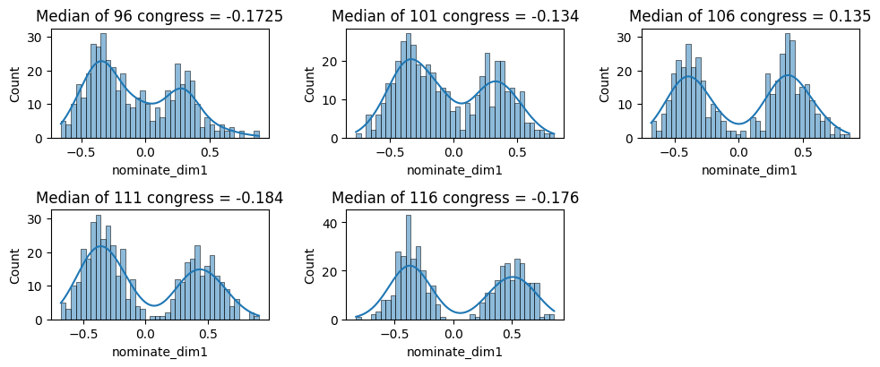

# Political Informatics

The world of politics generates an abundance of data such as polls, election results and districting plans. In this notebook, we demonstrate common data techniques to visualise and analyse the data.

# Downloads and Imports


```python
import os
import numpy as np
import pandas as pd
import matplotlib.pyplot as plt
import seaborn as sns
```

# Raising funds


```python
print(os.getcwd())
```

    /content


```python
df = pd.read_csv('/content/drive/MyDrive/Data/weball20.txt', sep='|', header=None)
print(df)
```

                 0                          1  2   3    4           5          6   \
    0     H8AK00132             SHEIN, DIMITRI  C   1  DEM        0.00       0.00   
    1     H6AK00045            YOUNG, DONALD E  I   2  REP  1950289.86  138304.94   
    2     H8AK01031        NELSON, THOMAS JOHN  C   2  REP        0.00       0.00   
    3     H8AK00140              GALVIN, ALYSE  C   3  IND  5253251.54   60024.76   
    4     H0AL01097            AVERHART, JAMES  O   1  DEM    80094.95       0.00   
    ...         ...                        ... ..  ..  ...         ...        ...   
    3984  S0WY00186  HOLTHUS, ROLLAND SCOTT MR  O   2  REP     4291.94       0.00   
    3985  S4WY00097           HARDY, CHARLES E  C   2  REP        0.00       0.00   
    3986  S4WY00147              MILLER, BRYAN  O   2  REP    50876.53    3685.02   
    3987  S6WY00068           BARRASSO, JOHN A  I   2  REP  1008180.71   28538.06   
    3988  S6WY00126            ENZI, MICHAEL B  I   2  REP   141784.99       0.00   
    
                  7        8           9   ...  20  21  22  23  24         25  \
    0         367.52     0.00      367.52  ... NaN NaN NaN NaN NaN       0.00   
    1     1817836.79     0.00   116720.12  ... NaN NaN NaN NaN NaN  839094.63   
    2         466.51     0.00      466.51  ... NaN NaN NaN NaN NaN       0.00   
    3     5162902.93     0.00     6245.09  ... NaN NaN NaN NaN NaN  340486.99   
    4       78973.24     0.00        0.00  ... NaN NaN NaN NaN NaN       0.00   
    ...          ...      ...         ...  ...  ..  ..  ..  ..  ..        ...   
    3984     4291.94     0.00        0.00  ... NaN NaN NaN NaN NaN       0.00   
    3985      165.00     0.00      165.00  ... NaN NaN NaN NaN NaN       0.00   
    3986    50876.53  3685.02        0.00  ... NaN NaN NaN NaN NaN       0.00   
    3987   844064.26     0.00  3957773.06  ... NaN NaN NaN NaN NaN  416150.00   
    3988   369883.72     0.00   481110.30  ... NaN NaN NaN NaN NaN  117600.00   
    
               26          27        28       29  
    0         0.0  09/30/2019      0.00      0.0  
    1       500.0  12/31/2020  19609.67   5500.0  
    2         0.0  03/31/2019      0.00      0.0  
    3     10025.0  12/31/2020  32594.02      0.0  
    4         0.0  12/31/2020      0.00      0.0  
    ...       ...         ...       ...      ...  
    3984      0.0  07/07/2020      0.00      0.0  
    3985      0.0  03/28/2019      0.00      0.0  
    3986      0.0  12/31/2020      0.00      0.0  
    3987      0.0  12/31/2020      0.00   9300.0  
    3988      0.0  12/31/2020  12650.00  68500.0  
    
    [3989 rows x 30 columns]


```python
df1 = df.drop(columns=[3,6,7,8,9,10,11,12,13,14,15,16,17,19,20,21,22,24,25,26,27,28,29])
```

State and district are in column 19 and 20 respectively. Contributions are in column 26, 27 respectively.
The whole dataset correspond to a year.


```python
df1 = df1.rename(columns = {0:"ID"})
df1 = df1.rename(columns = {1:"Name"}) 
df1 = df1.rename(columns = {2:"I/C"})
df1 = df1.rename(columns = {4:"Party"}) 
df1 = df1.rename(columns = {5:"$$"})
df1 = df1.rename(columns = {18:"State"}) 
df1 = df1.rename(columns = {23:"Status"})
```


```python
top25 = df1[df1["$$"] > 2]
print(top25.sort_values("$$", ascending=False).head(25))
```

                 ID                            Name I/C Party            $$ State  \
    3303  P20003851       ELGAR, MISS BETSY PAULINE   C   CON  4.824618e+09    00   
    3232  P00014530           BLOOMBERG, MICHAEL R.   C   DEM  1.124593e+09    00   
    3250  P80000722              BIDEN, JOSEPH R JR   C   DEM  1.074180e+09    00   
    3295  P80001571                TRUMP, DONALD J.   I   REP  7.443502e+08    00   
    3251  P80003205                MERCER, LEE L JR   C   DEM  6.400000e+08    00   
    3228  P00012716                     STEYER, TOM   C   DEM  3.530420e+08    00   
    3246  P60007168                SANDERS, BERNARD   C   DEM  2.189070e+08    00   
    3521  S8GA00180             OSSOFF, T. JONATHAN   C   DEM  1.561465e+08    GA   
    3860  S0SC00289                 HARRISON, JAIME   C   DEM  1.326857e+08    SC   
    3204  P00009621               WARREN, ELIZABETH   C   DEM  1.313681e+08    00   
    3516  S0GA00559                WARNOCK, RAPHAEL   C   DEM  1.253591e+08    GA   
    3862  S0SC00149              GRAHAM, LINDSEY O.   I   REP  1.077475e+08    SC   
    3426  S0AZ00350                     KELLY, MARK   I   DEM  1.011066e+08    AZ   
    3533  S4GA11285                   PERDUE, DAVID   I   REP  9.920297e+07    GA   
    3607  S0KY00339                    MCGRATH, AMY   C   DEM  9.633168e+07    KY   
    3523  S0GA00526                 LOEFFLER, KELLY   I   REP  9.221328e+07    GA   
    3660  S0ME00111                    GIDEON, SARA   C   DEM  7.562914e+07    ME   
    3436  S8AZ00221                 MCSALLY, MARTHA   I   REP  7.355330e+07    AZ   
    3618  S2KY00012                MCCONNELL, MITCH   I   REP  6.809490e+07    KY   
    3545  S0IA00176             GREENFIELD, THERESA   C   DEM  5.635830e+07    IA   
    3254  P80006117               KLOBUCHAR, AMY J.   C   DEM  5.456927e+07    00   
    3721  S0NC00202                 CUNNINGHAM, CAL   C   DEM  5.256913e+07    NC   
    3674  S4MI00355                    PETERS, GARY   I   DEM  5.011327e+07    MI   
    1477  H8MI09068                    PETERS, GARY   C   DEM  5.011327e+07    MI   
    3352  P00009696  BEHRMAN, DAN TAXATION IS THEFT   C   LIB  5.004389e+07    00   
    
          Status  
    3303     NaN  
    3232     NaN  
    3250     NaN  
    3295     NaN  
    3251     NaN  
    3228     NaN  
    3246     NaN  
    3521     NaN  
    3860     NaN  
    3204     NaN  
    3516     NaN  
    3862     NaN  
    3426     NaN  
    3533     NaN  
    3607     NaN  
    3523     NaN  
    3660     NaN  
    3436     NaN  
    3618     NaN  
    3545     NaN  
    3254     NaN  
    3721     NaN  
    3674     NaN  
    1477     NaN  
    3352     NaN  


# Districting


```python
! pip install geopandas folium -U matplotlib mapclassify contextily
! pip install folium -U
! pip install -I matplotlib==3.1.1
import matplotlib.pyplot as plt
import geopandas
import contextily as cx
from shapely.geometry import Point
```

We inspect the districting plan proposed by both the Democratic and Republican. Note that Shapefiles are a collection of files, instead of just one single file.


```python
from zipfile import ZipFile

with ZipFile('/content/drive/MyDrive/Data/ny_2020_congress_letters_draft_2021-09-15.zip', 'r') as zipObj:
   # Extract all the contents of zip file in different directory
   zipObj.extractall('nydem2020')
ny_dem = geopandas.read_file('nydem2020')

with ZipFile('/content/drive/MyDrive/Data/ny_2020_congress_names_draft_2021-09-15.zip', 'r') as zipObj:
   # Extract all the contents of zip file in different directory
   zipObj.extractall('nyrepub2020')
ny_repub = geopandas.read_file('nyrepub2020')
```


```python
print(len(ny_dem.columns)) 
for col_name in ny_dem.columns:
  print(col_name, end=' ')
```

    23
    ID AREA DISTRICT MEMBERS LOCKED NAME POPULATION CVAP_1519_ CVAP_15191 CVAP_15192 CVAP_15193 CVAP_15194 IDEAL_VALU DEVIATION F_DEVIATIO F_CVAP_151 F_CVAP_152 F_CVAP_153 F_CVAP_154 F_CVAP_155 MULTIPLE_F DISTRICT_L geometry 

Explore the different styles available in Pyplot.


```python
fig = plt.figure(dpi=100, figsize=(10, 20), tight_layout=True)
available = ['default'] + plt.style.available
for i, style in enumerate(available):
    with plt.style.context(style):
        ax = fig.add_subplot(10, 3, i + 1)
        ny_dem.plot(ax=ax)
    ax.set_title(style)
```


The last column is the geometry column. We use iat to extract one of its entry (a district) and then inspect it.


```python
geom_cd1 = ny_dem.iat[0,22]
print('type of geom_cd1 is', geom_cd1.geom_type) 
print('Area of CD1 is', geom_cd1.area) 
print('Length of CD1 is', geom_cd1.length) 
```

    type of geom_cd1 is Polygon
    Area of CD1 is 0.49612352814600036
    Length of CD1 is 4.547818041054305


We now plot and compare the plans from the respective party.


```python
ax1 = plt.subplot(1, 2, 1)
ny_dem.plot(ax=ax1)
ax1.set_title("Democratic Districting")
ax2 = plt.subplot(1, 2, 2)
ny_repub.plot(ax=ax2)
ax2.set_title("Republican Districting")
```


    Text(0.5, 1, 'Republican Districting')


```python
fig, ax = plt.subplots()
ny_dem.boundary.plot(ax=ax, color='blue')
ny_repub.boundary.plot(ax=ax, color='red')
ax.set_title('Districting Plan for Both Parties')
```


    Text(0.5, 1, 'Districting Plan for Both Parties')


Before calculating the area, we should convert Geographic Coordinate Systems (GCS) to Coordinate Reference Systems (CRS) which represent actual ground distances. Below are some very common projections.

*   WGS84 Latitude/Longitude: "EPSG:4326"

*   UTM Zones (North): "EPSG:32633"

*   UTM Zones (South): "EPSG:32733"


```python
# Check if a location is within another
location = Point(-73.123019144744, 40.91214434980682)
for i in range(len(ny_dem)):
  geom_cd = ny_dem.iat[i,22]
  if (location.within(geom_cd)):
    print('My CD is congressional district', ny_dem.loc[i, "ID"])
```

    My CD is congressional district 3


```python
li_cd = ny_dem.loc[0:0, :]
li_cd = li_cd.to_crs(epsg=3857)
lx = li_cd.plot(figsize=(15, 10), alpha=0.5, edgecolor='k')
cx.add_basemap(lx, crs=li_cd.crs)
plt.show()
```


```python
print('NY coordinate system is ', ny_dem.crs)
ny_dem_wm = ny_dem.to_crs(epsg=3857)
print('New NY cordinate system is ', ny_dem_wm.crs)
lx = ny_dem_wm.plot(figsize=(15, 10), alpha=0.5, edgecolor='k')
cx.add_basemap(lx, crs=ny_dem_wm.crs)
plt.show()
```

    NY coordinate system is  epsg:4269
    New NY cordinate system is  epsg:3857


# Survey data

American National Election Studies (ANES) is a survey on politcal preference.


```python
anes = pd.read_csv("/content/drive/MyDrive/Data/anes_timeseries_2016_rawdata.txt", sep='|', header='infer', low_memory=False)
```

Each column starting with V is an election variable encoding a response to a question. Use the codebook to interpret them.


```python
anes2 = anes.iloc[:,[1,30,63,128,129,137,138,170,212,217,223,367,374]].copy()
print(anes2)
```

          V160001 V161010e  V161031  V161086  V161087  V161095  V161096  V161126  \
    0           1       LA        2        0       85        0       70       99   
    1           2       AR        2        0       85       15       85        5   
    2           3       MS       -1       50       60       50       50       99   
    3           4       TN       -1        0       60       30       70       99   
    4           5       OH        3       15        0       70       40        4   
    ...       ...      ...      ...      ...      ...      ...      ...      ...   
    4265     5086       VA        1       86        3       98       40       99   
    4266     5087       VA        2       50      100       50      100        4   
    4267     5088       GA       -1        0       86       50       51        4   
    4268     5089       NC        1       85        0       85       16        6   
    4269     5090       MO        1       60       40       30       70       99   
    
          V161155  V161159  V161165  V161267  V161270  
    0           2        5        2       29        9  
    1           2        3        3       26       13  
    2           3        4        4       23        9  
    3           0        4        3       58        9  
    4           3        5        3       38        9  
    ...       ...      ...      ...      ...      ...  
    4265        1        2        5       37       13  
    4266        1        5        2       82        6  
    4267        1        5        3       27        9  
    4268        1        1        5       39       12  
    4269        2        4        3       52       13  
    

```python
plt.figure(figsize=(24, 6), dpi=80)
anes2['V161086'].value_counts().plot(kind='bar')
```


    <matplotlib.axes._subplots.AxesSubplot at 0x7f342782dfd0>


```python
anes2['DemCand_Feel'] = anes2['V161086'].replace([-88,-89,-99], np.nan)

plt.figure(figsize=(24, 6), dpi=80)
anes2['DemCand_Feel'].value_counts().plot(kind='bar')
```


    <matplotlib.axes._subplots.AxesSubplot at 0x7f3427656390>


```python
anes2['RepCand_Feel'] = anes2['V161087'].replace([-88,-89,-99], np.nan)

plt.figure(figsize=(24, 6), dpi=80)
anes2['RepCand_Feel'].value_counts().plot(kind='bar')
```


    <matplotlib.axes._subplots.AxesSubplot at 0x7f342736ca50>


```python
anes2['DemParty_Feel'] = anes2['V161095'].replace([-88,-89,-99], np.nan)

plt.figure(figsize=(24, 6), dpi=80)
anes2['DemParty_Feel'].value_counts().plot(kind='bar')
```


    <matplotlib.axes._subplots.AxesSubplot at 0x7f3427189510>


```python
anes2['RepParty_Feel'] = anes2['V161096'].replace([-88,-89,-99], np.nan)

plt.figure(figsize=(24, 6), dpi=80)
anes2['RepParty_Feel'].value_counts().plot(kind='bar')
```


    <matplotlib.axes._subplots.AxesSubplot at 0x7f342701ffd0>


```python
anes2['V161031'].value_counts().plot(kind='bar')
# Notice we only are looking at Clinton and Trump supporters!
anes2['Pres_Choice'] = anes2['V161031'].replace([3,4,5,6,7,8,-1,-8,-9], np.nan)
anes2['Pres_Choice'].value_counts().plot(kind='bar', title='Clinton vs Trump')
```


    <matplotlib.axes._subplots.AxesSubplot at 0x7f3426be8810>


```python
anes2['Pres_Choice_Bin'] = anes2['Pres_Choice'].replace([2.0], 0.0)
# Trump = 0, Clinton = 1
labels = ("Clinton", "Trump")
x = np.arange(len(labels))  # the label locations
width = 0.35  # the width of the bars

fig, ax = plt.subplots()
ax.bar(x-width/2, height=(48.18/(48.18+46.09), 46.09/(48.18+46.09)), width=width)
ax.bar(x+width/2, height=anes2['Pres_Choice_Bin'].value_counts(normalize=True), width=width)

ax.set_ylabel('Percentage')
ax.set_title('Two-Party Vote Share')
ax.set_xticks(x, labels)
```


    [<matplotlib.axis.XTick at 0x7f34268a39d0>,
     <matplotlib.axis.XTick at 0x7f3426893450>]


```python
# recode ideology and education
anes2['Ideology'] = anes2['V161126'].replace([-8,-9,99], np.nan)
anes2['Education'] = anes2['V161270'].replace([-9,90,95], np.nan)
```


```python
anes3 = anes2.iloc[:, [1,13,14,15,16,17,18,19,20]]
crosstab1 = pd.crosstab(anes3['Ideology'], anes3['Pres_Choice_Bin'])
print(crosstab1)
```

    Pres_Choice_Bin  0.0  1.0
    Ideology                 
    1.0                5  113
    2.0                9  413
    3.0               28  245
    4.0              225  318
    5.0              234   88
    6.0              521   36
    7.0              132    8


We can try different plots to visualise the relationship between a number of variables.


```python
# Scatterplot shaded with ideology
sns.scatterplot(x='DemCand_Feel',
                y='RepCand_Feel',
                data=anes3,
                style='Pres_Choice_Bin',
                hue='Ideology',
                palette=['darkblue','blue','dodgerblue','gray','lightcoral','red','darkred']).set(title='Feelings Shaded by Ideology')
```


    [Text(0.5, 1.0, 'Feelings Shaded by Ideology')]


```python
# Subset for feeling thermometer variables
anes4 = anes3.iloc[:,1:5]
# Create scatter matrix for all rows and 4 columns:
pd.plotting.scatter_matrix(anes4,
                           figsize=(8,8),
                           diagonal='kde',
                           color = 'firebrick')
```


# Personality

Cooperative Election Study (CES; formerly CCES) uses national stratified sample to survey both before and after election.


```python
cces = pd.read_excel('/content/drive/MyDrive/Data/cces09.xlsx')
print(cces.head(10))
# Keep columns 0, 14-23, 46
cces2 = cces.iloc[:, [0,14,15,16,17,18,19,20,21,22,23,46]].copy()
```

       v100      v200   v253 v256     v257 v258                  v259  \
    0    13  0.989434  98951  yes      NaN  yes            washington   
    1    17  1.121297   6480  yes      NaN  yes           connecticut   
    2    21  0.509285  98250  yes      NaN  yes            washington   
    3    27  0.667578  21146  yes      NaN  yes              maryland   
    4    28  0.637473  80239  yes  80602.0  no               colorado   
    5    30  1.201423  20009  yes      NaN  yes  district of columbia   
    6    33  1.089622  95918  yes      NaN  yes            california   
    7    36  1.039338  63501  yes  68057.0  no               nebraska   
    8    37  0.953096  80521  yes      NaN  yes              colorado   
    9    38  0.819609  35080  yes      NaN  yes               alabama   
    
                             cc09_01                  cc09_02           cc09_03  \
    0                     rural area          cell phone only     5 - 10 years    
    1                           town          cell phone only     5 - 10 years    
    2                     rural area            landline only  10 or more years   
    3  suburb of a medium sized city  landline and cell phone       1 - 2 years   
    4   outer suburb of a large city  landline and cell phone     5 - 10 years    
    5                in a large city  landline and cell phone  10 or more years   
    6                     rural area  landline and cell phone     5 - 10 years    
    7                in a small city          cell phone only      1 - 6 months   
    8         in a medium sized city  landline and cell phone     5 - 10 years    
    9                in a small city  landline and cell phone  10 or more years   
    
       ... v247 v264 v291 v265           v267 v269   v272  \
    0  ...    2    4   WA   53         Yakima   77  126.0   
    1  ...    3    1   CT    9      Middlesex    7   27.0   
    2  ...    3    2   WA   53       San Juan   55   12.0   
    3  ...    2    1   MD   24   Anne Arundel    3   23.0   
    4  ...    3    2   CO    8          Adams    1    NaN   
    5  ...    3    0   DC   11  District of C    1    8.0   
    6  ...    3    2   CA    6           Yuba  115   19.0   
    7  ...    1    1   NE   31          Dodge   53   76.0   
    8  ...    2    4   CO    8        Larimer   69   18.0   
    9  ...    3    6   AL    1         Shelby  117   40.0   
    
                            v271                    v401                    v402  
    0  Yakima-Pasco-Richland, WA 2009-11-05 11:27:19.501 2009-11-05 11:44:50.292  
    1     Hartford-New Haven, CT 2009-11-05 11:28:40.831 2009-11-05 12:01:08.832  
    2         Seattle-Tacoma, WA 2009-11-05 11:29:48.455 2009-11-05 12:29:24.714  
    3              Baltimore, MD 2009-11-05 11:29:57.461 2009-11-05 11:50:05.457  
    4                        NaN 2009-11-05 11:30:02.306 2009-11-05 12:02:37.519  
    5             Washington, DC 2009-11-05 11:30:57.159 2009-11-05 11:45:17.228  
    6    Sacramento-Stockton, CA 2009-11-05 11:31:23.290 2009-11-05 12:01:43.762  
    7                  Omaha, NE 2009-11-05 11:31:39.086 2009-11-05 12:03:24.521  
    8                 Denver, CO 2009-11-05 11:31:43.202 2009-11-05 11:54:25.182  
    9             Birmingham, AL 2009-11-05 11:32:04.167 2009-11-10 02:46:07.876  
    
    [10 rows x 184 columns]


```python
cces3 = cces2.fillna(99)
```


```python
def ideo_recode(cc09_42a):
  if cc09_42a == 'very liberal ':
    return 1
  if cc09_42a == 'liberal ':
    return 2
  if cc09_42a == 'somewhat liberal':
    return 3
  if cc09_42a == 'middle of the road':
    return 4
  if cc09_42a == 'somewhat conservative':
    return 5
  if cc09_42a == 'conservative ':
    return 6
  if cc09_42a == 'very conservative':
    return 7
  if cc09_42a == 99:
    return np.nan
  else:
    return np.nan
cces3['Ideology'] = cces3['cc09_42a'].apply(ideo_recode)
```


```python
def open_recode(cc09_07e):
  if cc09_07e == 'disagree strongly ':
    return 1
  if cc09_07e == 'disagree moderately ':
    return 2
  if cc09_07e == 'disagree a little':
    return 3
  if cc09_07e == 'neither agree nor disagree':
    return 4
  if cc09_07e == 'agree a little':
    return 5
  if cc09_07e == 'agree moderately ':
    return 6
  if cc09_07e == 'agree strongly':
    return 7
  if cc09_07e == 99: 
    return np.nan
  else:
    return np.nan
cces3['Open'] = cces3['cc09_07e'].apply(open_recode)
```


```python
def conventional_recode(cc09_07j):
  if cc09_07j == 'disagree strongly ':
    return 7
  if cc09_07j == 'disagree moderately ':
    return 6
  if cc09_07j == 'disagree a little':
    return 5
  if cc09_07j == 'neither agree nor disagree':
    return 4
  if cc09_07j == 'agree a little':
    return 3
  if cc09_07j == 'agree moderately ':
    return 2
  if cc09_07j == 'agree strongly':
    return 1
  if cc09_07j == 99: 
    return np.nan
  else:
    return np.nan
cces3['Conventional'] = cces3['cc09_07j'].apply(conventional_recode)
```


```python
sns.jointplot(x='Open', y='Conventional', data=cces3, cmap='Reds', shade=True, kind='kde')
plt.show()
```


```python
cces3['Aggregated Openness'] = cces3['Conventional'] + cces3['Open']
sns.jointplot(x='Ideology', y='Aggregated Openness', data=cces3, cmap='Blues', shade=True, kind='kde')
```


# Text Preprocessing


```python
! pip install textblob
! pip install vaderSentiment
! pip install wordcloud
import nltk, string
from textblob import TextBlob
from vaderSentiment.vaderSentiment import SentimentIntensityAnalyzer
nltk.download('stopwords')
nltk.download('punkt')
from nltk.corpus import stopwords
from wordcloud import WordCloud, STOPWORDS
```


```python
text = 'That\'s why the NATO Alliance was created: to secure peace and stability in Europe after World War Two. The United States is a member, along with 29 other nations.'

lowered = text.lower()
no_num = ''.join([word for word in lowered if not word.isdigit()])
no_punc = no_punc = no_num.translate(str.maketrans('', '', string.punctuation))
tokens = nltk.tokenize.word_tokenize(no_punc)
stopwords = set(nltk.corpus.stopwords.words('english'))
cleaned = [word for word in tokens if not word in stopwords]
print(cleaned)
```

    ['thats', 'nato', 'alliance', 'created', 'secure', 'peace', 'stability', 'europe', 'world', 'war', 'two', 'united', 'states', 'member', 'along', 'nations']


```python
text = 'That\'s why the NATO Alliance was created: to secure peace and stability in Europe after World War Two. The United States is a member, along with 29 other nations.'
blob = TextBlob(text)
print(blob.ngrams(n=2))
print(blob.sentiment)
```

    [WordList(['That', "'s"]), WordList(["'s", 'why']), WordList(['why', 'the']), WordList(['the', 'NATO']), WordList(['NATO', 'Alliance']), WordList(['Alliance', 'was']), WordList(['was', 'created']), WordList(['created', 'to']), WordList(['to', 'secure']), WordList(['secure', 'peace']), WordList(['peace', 'and']), WordList(['and', 'stability']), WordList(['stability', 'in']), WordList(['in', 'Europe']), WordList(['Europe', 'after']), WordList(['after', 'World']), WordList(['World', 'War']), WordList(['War', 'Two']), WordList(['Two', 'The']), WordList(['The', 'United']), WordList(['United', 'States']), WordList(['States', 'is']), WordList(['is', 'a']), WordList(['a', 'member']), WordList(['member', 'along']), WordList(['along', 'with']), WordList(['with', '29']), WordList(['29', 'other']), WordList(['other', 'nations'])]
    Sentiment(polarity=0.1375, subjectivity=0.4875)


```python
analyzer = SentimentIntensityAnalyzer()
text1 ='That\'s whythe NATO Alliance was created: to secure peace and stability in Europe after World War Two.'
vader1 = analyzer.polarity_scores(text1)
print(vader1)
text2 = 'One way to fight inflation is to drive down wages and make Americans poorer.'
vader2 = analyzer.polarity_scores(text2)
print(vader2)
```

    {'neg': 0.157, 'neu': 0.524, 'pos': 0.319, 'compound': 0.4588}
    {'neg': 0.298, 'neu': 0.702, 'pos': 0.0, 'compound': -0.6249}


```python
def remove_punctuations(text):
  for punctuation in string.punctuation:
    text = text.replace(punctuation, '')
  return text
def remove_stopwords(tokens):
  stop_words = set(stopwords)
  return [word for word in tokens if not word in stop_words]
```


```python
dat = pd.read_csv('/content/drive/MyDrive/Data/state_of_the_union_texts.csv')
# Lowercase
dat['Text2'] = dat['Text'].str.lower()
# Numbers
dat['Text2'] = dat['Text2'].str.replace('\d+', '')
dat['Text3'] = dat['Text2'].apply(remove_punctuations).apply(nltk.word_tokenize).apply(remove_stopwords)
```

    /usr/local/lib/python3.7/dist-packages/ipykernel_launcher.py:5: FutureWarning: The default value of regex will change from True to False in a future version.
      """


```python
# Looking at polarity
def get_polarity(text):
  return TextBlob(text).sentiment.polarity
def get_subjectivity(text):
  return TextBlob(text).sentiment.subjectivity
dat['cleanstring'] = dat['Text3'].astype(str)
dat['Subjectivity'] = dat['cleanstring'].apply(get_subjectivity)
dat['Polarity'] = dat['cleanstring'].apply(get_polarity)
```


```python
# Two y-axes with Year as x-axis
# Create figure and axis objects with subplots()
fig,ax = plt.subplots()
# Create plot
ax.plot(dat['Year'], dat['Polarity'], color='darkgreen', marker='h')
# Set x-axis label
ax.set_xlabel('Year', fontsize=14)
# Set y-axis label
ax.set_ylabel('Polarity', color='darkgreen', fontsize=14)
# Second y-axis
ax2 = ax.twinx()
# Plot with different y-axis
ax2.plot(dat['Year'], dat['Subjectivity'], color='purple', marker='x')
# Set second y-axis label
ax2.set_ylabel('Subjectivity', color='purple', fontsize=14)
# Set plt.title and plt.show()
plt.title('Polarity and Subjectivity of SOTU Addresses Over Time', fontsize=14)
plt.show()
```


```python
def gen_wordcloud(text):
  # Lowercase text
  text = text.lower()
  # If you would like to update and add stopwords:
  stopwords = set(STOPWORDS)
  stopwords.update(["u", "o"])
  wordcloud = WordCloud(stopwords = STOPWORDS, collocations = False, background_color = 'white', max_words=150).generate(text)
  # Plot the wordcloud object
  plt.imshow(wordcloud, interpolation='bilinear')
  plt.axis('off')
  plt.title('WordCloud of SOTU')
  plt.show()
```


```python
# Joining the unprocessed speech
sotu_text = ' '.join(speech for speech in (dat['Text']))
gen_wordcloud(sotu_text)
```


```python
gwb_text = ' '.join(speech for speech in (dat.loc[dat['President'] == 'George W. Bush', 'Text']))
bo_text = ' '.join(speech for speech in (dat.loc[dat['President'] == 'Barack Obama', 'Text']))
gen_wordcloud(gwb_text)
gen_wordcloud(bo_text)
```


# Voting Ideology

Nominal Three-Step Estimation (NOMINATE) is a scaling method to represent members of Congress on a spatial map. 


```python
all = pd.read_csv("/content/drive/MyDrive/Data/Hall_members.csv")
#select 96th congress
df96 = all.loc[all["congress"] == 96]
df96 = df96.iloc[:, [0, 1, 2, 3, 4, 5, 6, 9, 13]]
# Only keep House members
df_house96 = df96.loc[df96['chamber'] < 'I']
ch96_median = df_house96['nominate_dim1'].median()
print(ch96_median)
# Histogram
plt.hist(df_house96['nominate_dim1'], bins = 40)
plt.title('Distribution -- 96th Congress')
plt.show()
# Density plot
sns.distplot(df_house96['nominate_dim1'],
  hist = True,
  kde = True,
  bins = 40)
plt.title('Density -- 96th Congress')
plt.show()
```

    -0.1725


```python
fig = plt.figure(dpi=100, figsize=(10, 20), tight_layout=True)
for i, congress in enumerate([96, 101, 106, 111, 116]):
  df = all.loc[all["congress"] == congress]
  df = df.iloc[:, [0, 1, 2, 3, 4, 5, 6, 9, 13]]
  dfhouse = df.loc[df['chamber'] < 'I']
  ax = fig.add_subplot(10, 3, i + 1)
  sns.histplot(dfhouse['nominate_dim1'],
    kde=True,
    bins=40,
    ax=ax)
  plt.title(f"Median of {congress} congress = {dfhouse['nominate_dim1'].median()}")
plt.show()
```



